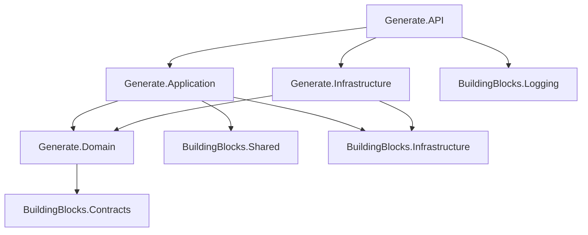

# Generate Service Architecture Documentation

## 🏗️ **Domain-Driven Design (DDD) + Clean Architecture Implementation**

> *"Architecture is about the important stuff. Whatever that is."* - Martin Fowler

Generate service là một implementation của **DDD + Clean Architecture**, tuân thủ nghiêm ngặt các nguyên tắc thiết kế để tạo ra một hệ thống **maintainable**, **testable**, và **scalable**.

---

## 📊 **Tổng Quan Kiến Trúc**

```
┌─────────────────────────────────────────────────────────────────┐
│                       CLEAN ARCHITECTURE                        │
├─────────────────────────────────────────────────────────────────┤
│                                                                 │
│  ┌─────────────┐    ┌──────────────────┐    ┌────────────────┐  │
│  │     API     │ ──▶│   Application    │ ──▶│     Domain    │  │
│  │             │    │                  │    │                │  │
│  │ Controllers │    │ Commands/Queries │    │ Entities/VOs   │  │
│  │ Extensions  │    │ Handlers/Policies│    │ Business Logic │  │
│  └─────────────┘    └──────────────────┘    └────────────────┘  │
│         │                     │                       ▲         │
│         │                     │                       │         │
│         ▼                     ▼                       │         │
│  ┌─────────────────────────────────────────────────────────────┐│
│  │                  Infrastructure                             ││
│  │                                                             ││
│  │  ┌──────────────┐  ┌─────────────┐  ┌─────────────────────┐ ││
│  │  │ Repositories │  │ Persistence │  │    Configurations   │ ││
│  │  │     Impl     │  │   Context   │  │   Shadow Properties │ ││
│  │  └──────────────┘  └─────────────┘  └─────────────────────┘ ││
│  └─────────────────────────────────────────────────────────────┘│
└─────────────────────────────────────────────────────────────────┘
```

---

## 🗂️ **Chi Tiết Cấu Trúc Thư Mục**

### **🎯 Generate.Domain** - *Pure Business Logic*

```
Generate.Domain/
├── Entities/                           # Domain Aggregates (DDD) + Business Logic Separation
│   ├── Categories/
│   │   ├── Category.cs                 # Category Aggregate Root
│   │   ├── CategoryError.cs            # Business Exception Definitions
│   │   ├── Rules/                      # Business Logic Separation
│   │   │   ├── CategoryValidationRules.cs # Validation Logic
│   │   │   └── CategoryBusinessRules.cs   # Complex Business Operations
│   │   ├── Specifications/             # Specification Pattern
│   │   │   └── CategorySpecifications.cs  # Business Queries & Conditions
│   │   ├── Enums/                      # Category-specific enums
│   │   └── ValueObject/                # Category Value Objects
│   ├── Products/
│   │   ├── Product.cs                  # Product Aggregate Root
│   │   ├── ProductError.cs             # Business Exception Definitions (existing)
│   │   ├── Rules/                      # Business Logic Separation
│   │   │   ├── ProductValidationRules.cs  # Validation Logic
│   │   │   └── ProductBusinessRules.cs    # Complex Business Operations
│   │   ├── Specifications/             # Specification Pattern
│   │   │   └── ProductSpecifications.cs   # Business Queries & Conditions
│   │   ├── Enums/                      # Product-specific enums
│   │   └── ValueObject/
│   │       └── ProductDetail.cs        # Product Detail Value Object
│   └── Orders/
│       ├── Order.cs                    # Order Aggregate Root (refactored)
│       ├── OrderError.cs               # Business Exception Definitions
│       ├── Rules/                      # Business Logic Separation
│       │   ├── OrderValidationRules.cs    # Validation Logic
│       │   └── OrderBusinessRules.cs      # Complex Business Operations
│       ├── Specifications/             # Specification Pattern
│       │   └── OrderSpecifications.cs     # Business Queries & Conditions
│       ├── Enums/                      # Order-specific enums
│       └── ValueObject/
│           └── OrderItem.cs            # Order Item Entity
├── Services/                           # Domain Services
│   └── OrderDomainService.cs           # Cross-Aggregate Operations
├── Repositories/                       # Repository Contracts (Interfaces)
│   ├── ICategoryRepository.cs          # Category Repository Contract
│   ├── IProductRepository.cs           # Product Repository Contract
│   └── IOrderRepository.cs             # Order Repository Contract
└── Generate.Domain.csproj              # Dependencies: ONLY Contracts
```

**🎯 Tại sao sắp xếp như này?**

- **Aggregates theo Business Context**: Mỗi folder (Categories, Products, Orders) đại diện cho 1 **Bounded Context**
- **Business Logic Separation**: Tách business logic ra khỏi entities để dễ maintain và test
- **Repository Interfaces trong Domain**: Tuân thủ **Dependency Inversion Principle** - Domain định nghĩa contract, Infrastructure implement
- **Error Classes**: Centralized business exceptions theo **Domain-Driven Design** (`CategoryError`, `ProductError`, `OrderError`)
- **Validation Rules**: Business validation logic tách riêng (`*ValidationRules.cs`)
- **Business Rules**: Complex business operations tách riêng (`*BusinessRules.cs`)
- **Specifications**: Business queries và conditions sử dụng Specification Pattern (`*Specifications.cs`)
- **Domain Services**: Cross-aggregate operations (`OrderDomainService.cs`)
- **Value Objects**: Encapsulate business concepts không có identity (ProductDetail, OrderItem)
- **Zero Infrastructure Dependencies**: Domain layer hoàn toàn pure, chỉ phụ thuộc Contracts

---

### **🔧 Generate.Infrastructure** - *Technical Implementation*

```
Generate.Infrastructure/
├── Persistences/
│   ├── Configurations/                 # EF Core Configurations
│   │   ├── CategoryConfiguration.cs    # Category Entity Mapping
│   │   ├── ProductConfiguration.cs     # Product Entity Mapping + Shadow Properties
│   │   ├── ProductDetailConfiguration.cs # ProductDetail Mapping
│   │   ├── OrderConfiguration.cs       # Order Entity Mapping
│   │   ├── OrderItemConfiguration.cs   # OrderItem Composite Key Mapping
│   │   └── AuditConfigurationExtensions.cs # Audit Fields Extensions
│   └── GenerateContext.cs              # EF Core DbContext
├── Repositories/                       # Repository Implementations
│   ├── CategoryRepository.cs           # ICategoryRepository Implementation
│   ├── ProductRepository.cs            # IProductRepository Implementation
│   └── OrderRepository.cs              # IOrderRepository Implementation
├── ConfigureServices.cs                # DI Container Configuration
└── Generate.Infrastructure.csproj      # Dependencies: Domain + EF Core + Infrastructure
```

**🔧 Tại sao sắp xếp như này?**

- **Shadow Properties**: Xử lý foreign keys (CategoryId, ProductId, OrderId) mà Domain không biết
- **Configurations**: Tách biệt database schema khỏi domain models
- **Repository Pattern**: Implement Domain contracts với persistence concerns
- **Composite Keys**: OrderItem sử dụng composite key (OrderId + ProductId) theo SQL schema
- **Separation of Concerns**: Database logic tách biệt hoàn toàn khỏi business logic

---

### **💼 Generate.Application** - *Use Cases & Orchestration*

```
Generate.Application/
├── Common/
│   └── Mappings/
│       └── MapsterConfig.cs            # Object-to-Object Mapping Configuration
├── Features/                           # Feature-based Organization (Vertical Slices)
│   ├── Category/
│   │   ├── Commands/
│   │   │   ├── CreateCategory/         # Create Category Use Case
│   │   │   │   ├── CreateCategoryCommand.cs      # Command DTO
│   │   │   │   ├── CreateCategoryCommandHandler.cs # Business Logic Handler
│   │   │   │   └── CreateCategoryValidator.cs     # Input Validation
│   │   │   ├── UpdateCategory/         # Update Category Use Case
│   │   │   └── DeleteCategory/         # Delete Category Use Case
│   │   ├── Queries/
│   │   │   ├── GetCategories/          # Get All Categories
│   │   │   ├── GetCategoriesPaged/     # Paginated Categories
│   │   │   └── GetCategoryById/        # Get Single Category
│   │   ├── EventHandlers/              # Domain Event Handlers
│   │   └── Policies/                   # Authorization Policies
│   ├── Product/                        # Product Feature
│   │   ├── Commands/                   # CRUD Commands
│   │   ├── Queries/                    # Data Queries
│   │   ├── EventHandlers/              # Event Processing
│   │   └── Policies/                   # Access Control
│   └── Order/                          # Order Feature
│       ├── Commands/                   # Order Management
│       ├── Queries/                    # Order Retrieval
│       ├── EventHandlers/              # Order Events
│       └── Policies/                   # Order Permissions
└── Generate.Application.csproj         # Dependencies: Domain + Shared + Infrastructure
```

**💼 Tại sao sắp xếp như này?**

- **CQRS Pattern**: Commands (write operations) tách biệt Queries (read operations)
- **Vertical Slice Architecture**: Mỗi feature tự chứa tất cả layers cần thiết
- **Single Responsibility**: Mỗi handler chỉ xử lý 1 use case duy nhất
- **MediatR Integration**: Decoupling giữa controllers và business logic
- **Policy-based Authorization**: Centralized permission management

---

### **🌐 Generate.API** - *Presentation Layer*

```
Generate.API/
├── Controllers/
│   ├── CategoryController.cs           # Category REST Endpoints
│   ├── ProductController.cs            # Product REST Endpoints
│   └── OrderController.cs              # Order REST Endpoints
├── Extensions/
│   ├── ServiceExtension.cs             # DI Configuration
│   ├── ApplicationExtension.cs         # Application Setup
│   └── AuthenticationExtension.cs      # Auth Configuration
├── Filters/
│   └── ApiVersionOperationFilter.cs    # Swagger API Versioning
├── Properties/
│   └── launchSettings.json             # Development Settings
├── Program.cs                          # Application Entry Point
├── appsettings.json                    # Configuration
├── appsettings.Development.json        # Dev Configuration
└── Generate.API.csproj                 # Dependencies: All Layers
```

**🌐 Tại sao sắp xếp như này?**

- **API Versioning**: Support multiple API versions (v1.0, v2.0)
- **Thin Controllers**: Chỉ delegate to Application layer via MediatR
- **Cross-cutting Concerns**: Authentication, authorization, logging
- **Configuration Management**: Environment-based settings
- **OpenAPI/Swagger**: Automatic API documentation

---

## 🧩 **Business Logic Separation Pattern**

### **📋 Tổng Quan Pattern**

Để tránh **Fat Domain Models** và tuân thủ **Single Responsibility Principle**, Generate Domain áp dụng Business Logic Separation Pattern:

```
Entity (Core Data + Basic Operations)
├── ErrorClass.cs        # Centralized business exceptions
├── Rules/
│   ├── ValidationRules.cs   # Input validation logic
│   └── BusinessRules.cs     # Complex business operations  
├── Specifications/
│   └── Specifications.cs    # Business queries & conditions
└── [Domain Services]        # Cross-aggregate operations
```

### **🎯 Pattern Benefits**

#### **✅ Single Responsibility Principle**
```csharp
// BEFORE: Fat Entity (Order.cs - 148 lines)
public class Order
{
    // Properties + Validation + Business Logic + Queries = Mixed Concerns ❌
}

// AFTER: Separated Concerns
public class Order                      // 113 lines - focused on data + delegation ✅
public class OrderValidationRules       // Validation logic only ✅  
public class OrderBusinessRules         # Business operations only ✅
public class OrderSpecifications        # Query logic only ✅
```

#### **✅ Maintainability & Testability**
```csharp
// Unit test specific business rule
[Test]
public void OrderValidationRules_Should_Throw_When_CustomerName_Empty()
{
    // Arrange & Act & Assert - focused test ✅
    Assert.Throws<BusinessException>(() => 
        OrderValidationRules.CustomerName.ValidateCustomerName(""));
}

// Unit test business operation
[Test]  
public void OrderBusinessRules_Should_Add_Item_When_Valid()
{
    // Test complex business logic in isolation ✅
}
```

### **🏗️ Implementation Examples**

#### **1. Error Classes - Centralized Exceptions**
```csharp
// OrderError.cs
public static class OrderError
{
    public static BusinessException CustomerNameCannotBeEmpty() 
        => new("Customer name cannot be empty");
        
    public static BusinessException ProductNotFoundInOrder()
        => new("Product not found in this order");
}

// Usage: Consistent error messages
throw OrderError.CustomerNameCannotBeEmpty();
```

#### **2. Validation Rules - Input Validation**
```csharp
// OrderValidationRules.cs
public static class OrderValidationRules
{
    public static class CustomerName
    {
        public static void ValidateCustomerName(string customerName)
        {
            if (string.IsNullOrWhiteSpace(customerName))
                throw OrderError.CustomerNameCannotBeEmpty();
                
            if (customerName.Length > 100)
                throw OrderError.CustomerNameTooLong(100);
        }
    }
}
```

#### **3. Business Rules - Complex Operations**
```csharp
// OrderBusinessRules.cs  
public static class OrderBusinessRules
{
    public static class ItemManagement
    {
        public static void AddOrderItem(List<OrderItem> items, Order order, Product product, int quantity)
        {
            // 1. Validation
            OrderValidationRules.OrderItem.ValidateProduct(product);
            
            // 2. Business Logic
            var existingItem = items.FirstOrDefault(oi => ReferenceEquals(oi.Product, product));
            if (existingItem != null)
            {
                existingItem.IncreaseQuantity(quantity);  // Merge logic
            }
            else
            {
                var orderItem = OrderItem.Create(order, product, quantity);
                items.Add(orderItem);
            }
        }
    }
}
```

#### **4. Specifications - Business Queries**
```csharp
// OrderSpecifications.cs
public class IsLargeOrderSpecification : IOrderSpecification
{
    private readonly int _threshold;
    
    public IsLargeOrderSpecification(int threshold = 50) => _threshold = threshold;
    
    public bool IsSatisfiedBy(Order order)
    {
        return order.OrderItems.Sum(oi => oi.Quantity) >= _threshold;
    }
}

// Usage: Flexible business queries
var largeOrderSpec = new IsLargeOrderSpecification(100);
var vipSpec = new CustomerNamePatternSpecification("VIP");
var qualifiedSpec = largeOrderSpec.And(vipSpec);

bool isQualified = order.SatisfiesSpecification(qualifiedSpec);
```

### **🔄 Entity Refactoring Strategy**

#### **Before: Monolithic Entity** 
```csharp
public class Order : EntityAuditBase<long>
{
    // ❌ Mixed concerns in 148 lines:
    public void UpdateCustomerName(string name) 
    { 
        ValidateCustomerName(name);  // Validation mixed with logic
        CustomerName = name; 
    }
    
    private static void ValidateCustomerName(string name) { /* validation */ }
    public void AddOrderItem(Product product, int quantity) { /* business logic */ }
    public bool IsLargeOrder(int threshold = 50) { /* query logic */ }
    public decimal GetTotalOrderValue() { /* calculation */ }
}
```

#### **After: Separated Architecture**
```csharp
public class Order : EntityAuditBase<long>  // 113 lines - focused ✅
{
    // ✅ Delegate to specialized classes:
    public void UpdateCustomerName(string customerName)
    {
        OrderValidationRules.CustomerName.ValidateCustomerName(customerName);  // ← Delegate
        CustomerName = customerName;
    }
    
    public void AddOrderItem(Product product, int quantity)
    {
        OrderBusinessRules.ItemManagement.AddOrderItem(_orderItems, this, product, quantity);  // ← Delegate
    }
    
    public bool IsLargeOrder(int threshold = 50)
    {
        return OrderBusinessRules.Analytics.IsLargeOrder(_orderItems, threshold);  // ← Delegate
    }
    
    // ✅ Specification support
    public bool SatisfiesSpecification(OrderSpecifications.IOrderSpecification specification)
    {
        return specification.IsSatisfiedBy(this);
    }
}
```

### **📊 Comparison Metrics**

| Aspect | Monolithic Entity | Separated Architecture | Improvement |
|--------|------------------|----------------------|-------------|
| **Lines of Code** | 148 lines | 113 lines | ✅ -24% |
| **Responsibilities** | 5+ mixed | 1 focused | ✅ SRP compliant |
| **Testability** | Integration tests | Unit tests | ✅ Isolated testing |
| **Maintainability** | High coupling | Low coupling | ✅ Easy maintenance |
| **Reusability** | Entity-bound | Standalone classes | ✅ Cross-layer reuse |

### **🚀 Advanced Usage Patterns**

#### **Composite Specifications**
```csharp
// Business rule: VIP customers with large orders get free shipping
var vipLargeOrderSpec = new CustomerNamePatternSpecification("VIP")
    .And(new IsLargeOrderSpecification(50))
    .And(new HasItemsSpecification());

bool qualifiesForFreeShipping = order.SatisfiesSpecification(vipLargeOrderSpec);
```

#### **Domain Service Integration**
```csharp
public class OrderDomainService
{
    public OrderStatistics CalculateOrderStatistics(Order order)
    {
        var largeOrderSpec = new IsLargeOrderSpecification();
        var hasItemsSpec = new HasItemsSpecification();
        
        return new OrderStatistics
        {
            IsLargeOrder = order.SatisfiesSpecification(largeOrderSpec),
            HasItems = order.SatisfiesSpecification(hasItemsSpec),
            TotalItems = OrderBusinessRules.Analytics.CalculateTotalItemsCount(order.OrderItems)
        };
    }
}
```

---

## 🔗 **Dependency Flow Analysis**

### **✅ Correct Dependencies**



| Layer | Dependencies | Rationale |
|-------|-------------|-----------|
| **Domain** | → Contracts | Pure domain, only abstractions |
| **Infrastructure** | → Domain + Contracts + Infrastructure BB | Implements domain contracts |
| **Application** | → Domain + Shared + Contracts + Infrastructure BB | Business use cases + cross-cutting |
| **API** | → Application + Infrastructure + All BB | Composition root |

---

## 🎯 **DDD Concepts Implementation**

### **1. Aggregates & Entities**

```csharp
// Category Aggregate Root
public class Category : EntityAuditBase<long>
{
    public string Name { get; private set; } = string.Empty;
    private readonly List<Product> _products = new();
    public virtual IReadOnlyList<Product> Products => _products.AsReadOnly();
    
    // Factory Method (DDD Pattern)
    public static Category Create(string name) => new Category(name);
    
    // Business Methods (Domain Logic)
    public void UpdateName(string name) { ValidateName(name); Name = name; }
    public bool CanBeDeleted() => !_products.Any();
    public int GetProductCount() => _products.Count;
}
```

**🎯 DDD Benefits:**
- **Factory Methods**: Ensure valid object creation
- **Private Setters**: Prevent invalid state mutations  
- **Business Methods**: Encapsulate domain logic
- **Read-only Collections**: Protect aggregate boundaries

### **2. Value Objects**

```csharp
// ProductDetail Value Object
public class ProductDetail : AuditableBase<long>
{
    public string Description { get; private set; } = string.Empty;
    
    public static ProductDetail Create(string description) => new ProductDetail(description);
    
    public string GetSummary(int maxLength = 100) =>
        Description.Length <= maxLength ? Description : Description.Substring(0, maxLength) + "...";
}
```

### **3. Domain Services & Specifications**

```csharp
// ProductError - Domain Service for Business Rules
public static class ProductError
{
    public static BusinessException NameCannotBeEmpty() 
        => new("Product name cannot be empty");
        
    public static BusinessException CannotDeleteProductWithOrders() 
        => new("Cannot delete product that has existing orders");
}
```

---

## 🚀 **Clean Architecture Benefits**

### **1. Technology Independence**

**✅ Dễ dàng thay đổi Database:**

```csharp
// FROM: Entity Framework + SQL Server
services.AddDbContext<GenerateContext>(options =>
    options.UseSqlServer(connectionString));

// TO: MongoDB
services.AddScoped<ICategoryRepository, MongoCategoryRepository>();

// TO: In-Memory (Testing)
services.AddScoped<ICategoryRepository, InMemoryCategoryRepository>();
```

**✅ Dễ dàng thay đổi Messaging:**

```csharp
// FROM: RabbitMQ
services.AddMassTransit(x => x.UsingRabbitMq(...));

// TO: Azure Service Bus  
services.AddMassTransit(x => x.UsingAzureServiceBus(...));

// TO: Redis
services.AddStackExchangeRedisCache(...);
```

### **2. Framework Independence**

```csharp
// Domain Layer KHÔNG phụ thuộc vào Framework
public class Product : EntityAuditBase<long>  // ← Only domain abstractions
{
    // No [Table], [Column], [JsonProperty] attributes
    // No EF Core, ASP.NET, or any framework references
}
```

### **3. Testability**

```csharp
// Unit Testing Domain Logic
[Test]
public void Product_CanBeDeleted_ReturnsFalse_WhenHasOrderItems()
{
    // Arrange
    var product = Product.Create("Test Product");
    var order = Order.Create("Customer");
    product.AddOrderItem(OrderItem.Create(order, product, 1));
    
    // Act
    var canDelete = product.CanBeDeleted();
    
    // Assert
    Assert.False(canDelete);
}

// Integration Testing Application Layer
[Test]
public async Task CreateProduct_ShouldSucceed_WhenValidInput()
{
    // Arrange
    var mockRepository = new Mock<IProductRepository>();
    var handler = new CreateProductCommandHandler(mockRepository.Object);
    
    // Act
    var result = await handler.Handle(new CreateProductCommand("Test"), CancellationToken.None);
    
    // Assert
    Assert.NotNull(result);
}
```

---

## 📈 **Use Cases Scenarios**

### **Scenario 1: Thay Đổi Database từ SQL Server → PostgreSQL**

```bash
# 1. Update Infrastructure Layer only
# src/Generate.Infrastructure/Generate.Infrastructure.csproj
- <PackageReference Include="Microsoft.EntityFrameworkCore.SqlServer" Version="9.0.10" />
+ <PackageReference Include="Npgsql.EntityFrameworkCore.PostgreSQL" Version="9.0.10" />

# 2. Update Connection String
# appsettings.json  
- "Server=localhost;Database=GenerateDB;Trusted_Connection=true;"
+ "Host=localhost;Database=GenerateDB;Username=postgres;Password=***"

# 3. Update DbContext Registration
# ConfigureServices.cs
- options.UseSqlServer(connectionString)
+ options.UseNpgsql(connectionString)
```

**✅ Result**: Domain, Application, và API layers **KHÔNG CẦN THAY ĐỔI**

### **Scenario 2: Thay Đổi từ REST API → GraphQL**

```csharp
// 1. Add new GraphQL layer - Keep existing API
Generate.GraphQL/
├── Schemas/
│   ├── CategorySchema.cs
│   ├── ProductSchema.cs  
│   └── OrderSchema.cs
├── Resolvers/
│   ├── CategoryResolver.cs      // Reuse same Application handlers
│   └── ProductResolver.cs       // via MediatR
└── Program.cs

// 2. Resolver Implementation
public class ProductResolver
{
    private readonly IMediator _mediator;
    
    public async Task<Product> GetProduct(long id)
    {
        return await _mediator.Send(new GetProductByIdQuery(id));  // ← Reuse existing handlers
    }
}
```

**✅ Result**: Application, Domain, Infrastructure layers **HOÀN TOÀN TÁI SỬ DỤNG**

### **Scenario 3: Migration từ Monolith → Microservices**

```yaml
# docker-compose.yml
services:
  generate-api:
    image: generate-service:latest
    ports: ["5001:80"]
    environment:
      - ConnectionStrings__DefaultConnection=Server=generate-db;...
      
  catalog-api:          # New service splits Product domain
    image: catalog-service:latest  
    ports: ["5002:80"]
    
  order-api:            # New service splits Order domain  
    image: order-service:latest
    ports: ["5003:80"]

# Communication via Domain Events
services.AddMassTransit(x => {
    x.AddConsumer<ProductCreatedEventHandler>();  # ← Reuse existing handlers
    x.UsingRabbitMq(...);
});
```

**✅ Result**: **Bounded Contexts** đã sẵn sàng cho microservices split

---

## 🔍 **Advanced Patterns Implementation**

### **1. CQRS (Command Query Responsibility Segregation)**

```csharp
// Command Side (Write)
public record CreateProductCommand(string Name, long? CategoryId) : IRequest<long>;

public class CreateProductCommandHandler : IRequestHandler<CreateProductCommand, long>
{
    public async Task<long> Handle(CreateProductCommand request, CancellationToken cancellationToken)
    {
        var product = Product.Create(request.Name);  // ← Domain factory method
        var result = await _repository.CreateAsync(product);
        return result;
    }
}

// Query Side (Read)  
public record GetProductsQuery(ProductFilterDto Filter) : IRequest<PagedList<ProductResponseDto>>;

public class GetProductsQueryHandler : IRequestHandler<GetProductsQuery, PagedList<ProductResponseDto>>
{
    public async Task<PagedList<ProductResponseDto>> Handle(GetProductsQuery request, CancellationToken cancellationToken)
    {
        var query = _repository.FindAll();
        return query.ProjectToPagedList<ProductResponseDto>(request.Filter);  // ← Optimized projection
    }
}
```

### **2. Event Sourcing Ready**

```csharp
// Domain Events (Already implemented in base classes)
public class ProductCreated : BaseEvent
{
    public long ProductId { get; set; }
    public string Name { get; set; }
    public DateTime CreatedAt { get; set; }
}

// Event Handler
public class ProductCreatedEventHandler : INotificationHandler<ProductCreated>
{
    public async Task Handle(ProductCreated notification, CancellationToken cancellationToken)
    {
        // Update read models, send notifications, etc.
    }
}
```

### **3. Specification Pattern - Business Queries & Conditions**

#### **🎯 Specification Implementation**

```csharp
// OrderSpecifications.cs - Modern Specification Pattern
public class IsLargeOrderSpecification : IOrderSpecification
{
    private readonly int _threshold;
    
    public IsLargeOrderSpecification(int threshold = 50)
    {
        if (threshold <= 0)
            throw OrderError.InvalidThreshold(threshold);
        _threshold = threshold;
    }
    
    public bool IsSatisfiedBy(Order order)
    {
        var totalItems = order.OrderItems.Sum(oi => oi.Quantity);
        return totalItems >= _threshold;
    }
}

// ProductSpecifications.cs
public class IsPopularProductSpecification : IProductSpecification
{
    private readonly int _orderThreshold;
    
    public IsPopularProductSpecification(int orderThreshold = 10)
    {
        _orderThreshold = orderThreshold;
    }
    
    public bool IsSatisfiedBy(Product product)
    {
        return product.OrderItems.Count >= _orderThreshold;
    }
}

// CategorySpecifications.cs
public class HasActiveProductsSpecification : ICategorySpecification
{
    public bool IsSatisfiedBy(Category category)
    {
        return category.Products.Any(p => p.OrderItems.Any());
    }
}
```

#### **🚀 Specification Usage Examples**

##### **1. Single Specification Usage**
```csharp
// Check if order is large
var largeOrderSpec = new IsLargeOrderSpecification(100);
bool isLarge = order.SatisfiesSpecification(largeOrderSpec);

// Check if product is popular
var popularSpec = new IsPopularProductSpecification(20);
bool isPopular = product.SatisfiesSpecification(popularSpec);

// Check if category has active products
var activeSpec = new HasActiveProductsSpecification();
bool hasActive = category.SatisfiesSpecification(activeSpec);
```

##### **2. Composite Specifications - Business Rules**
```csharp
// Complex business rule: VIP customers with large orders
var vipLargeOrderSpec = new CustomerNamePatternSpecification("VIP")
    .And(new IsLargeOrderSpecification(50))
    .And(new HasItemsSpecification());

bool qualifiesForPremium = order.SatisfiesSpecification(vipLargeOrderSpec);

// Product eligibility for promotion
var promotionEligibleSpec = new IsPopularProductSpecification(15)
    .And(new IsInCategorySpecification())
    .And(new HasProductDetailSpecification());

bool canBePromoted = product.SatisfiesSpecification(promotionEligibleSpec);
```

##### **3. Business Logic Integration**
```csharp
public class DiscountService
{
    public decimal CalculateDiscount(Order order)
    {
        // Business rule matrix using specifications
        var largeOrderSpec = new IsLargeOrderSpecification(100);
        var vipCustomerSpec = new CustomerNamePatternSpecification("VIP");
        var hasItemsSpec = new HasItemsSpecification();
        
        // VIP + Large Order = 25% discount
        if (order.SatisfiesSpecification(vipCustomerSpec.And(largeOrderSpec)))
            return 0.25m;
            
        // Large Order = 15% discount
        if (order.SatisfiesSpecification(largeOrderSpec))
            return 0.15m;
            
        // VIP Customer = 10% discount
        if (order.SatisfiesSpecification(vipCustomerSpec))
            return 0.10m;
            
        // Has Items = 5% discount
        if (order.SatisfiesSpecification(hasItemsSpec))
            return 0.05m;
            
        return 0m; // No discount
    }
}
```

##### **4. Repository Pattern Integration**
```csharp
// Repository với Specification support
public class OrderRepository : IOrderRepository
{
    public async Task<List<Order>> FindBySpecificationAsync(IOrderSpecification specification)
    {
        var orders = await _context.Orders
            .Include(o => o.OrderItems)
            .ToListAsync();
            
        return orders.Where(order => specification.IsSatisfiedBy(order)).ToList();
    }
    
    // Specific business queries
    public async Task<List<Order>> FindLargeOrdersAsync(int threshold = 50)
    {
        var spec = new IsLargeOrderSpecification(threshold);
        return await FindBySpecificationAsync(spec);
    }
    
    public async Task<List<Order>> FindVipLargeOrdersAsync()
    {
        var spec = new CustomerNamePatternSpecification("VIP")
            .And(new IsLargeOrderSpecification(50));
        return await FindBySpecificationAsync(spec);
    }
}
```

##### **5. Application Layer Usage**
```csharp
public class ProcessOrderHandler : IRequestHandler<ProcessOrderCommand>
{
    public async Task Handle(ProcessOrderCommand request)
    {
        var order = await _repository.GetByIdAsync(request.OrderId);
        
        // Business validation using specifications
        var validationSpecs = new List<IOrderSpecification>
        {
            new HasItemsSpecification(),
            new IsLargeOrderSpecification(1).Not(), // Not too large for auto-processing
            new CustomerNamePatternSpecification("BLOCKED").Not() // Not blocked customer
        };
        
        foreach (var spec in validationSpecs)
        {
            if (!order.SatisfiesSpecification(spec))
            {
                throw new BusinessException($"Order validation failed: {spec.GetType().Name}");
            }
        }
        
        // Business routing using specifications
        var prioritySpec = new CustomerNamePatternSpecification("VIP")
            .Or(new IsLargeOrderSpecification(100));
            
        if (order.SatisfiesSpecification(prioritySpec))
        {
            await _priorityQueue.EnqueueAsync(order);
        }
        else
        {
            await _standardQueue.EnqueueAsync(order);
        }
    }
}
```

##### **6. Dynamic Filtering**
```csharp
public class OrderFilterService
{
    public List<Order> FilterOrders(List<Order> orders, OrderFilterCriteria criteria)
    {
        IOrderSpecification specification = new AlwaysTrueSpecification();
        
        // Dynamic specification building
        if (criteria.MinItems.HasValue)
        {
            specification = specification.And(
                new IsLargeOrderSpecification(criteria.MinItems.Value));
        }
        
        if (!string.IsNullOrEmpty(criteria.CustomerPattern))
        {
            specification = specification.And(
                new CustomerNamePatternSpecification(criteria.CustomerPattern));
        }
        
        if (criteria.HasItems)
        {
            specification = specification.And(new HasItemsSpecification());
        }
        
        return orders.Where(order => specification.IsSatisfiedBy(order)).ToList();
    }
}

// Usage
var criteria = new OrderFilterCriteria 
{ 
    MinItems = 50, 
    CustomerPattern = "Premium",
    HasItems = true 
};
var filteredOrders = filterService.FilterOrders(allOrders, criteria);
```

#### **📊 Specification Benefits in Practice**

| Scenario | Traditional Approach | Specification Approach | Benefits |
|----------|---------------------|----------------------|----------|
| **Business Rules** | Hardcoded in methods | Composable specs | ✅ Flexible |
| **Filtering** | Multiple if/else | Dynamic composition | ✅ Maintainable |
| **Testing** | Integration tests | Unit test specs | ✅ Isolated |
| **Reusability** | Copy-paste logic | Reuse specifications | ✅ DRY |

#### **🔧 Advanced Specification Patterns**

##### **Specification Factory**
```csharp
public static class OrderSpecificationFactory
{
    public static IOrderSpecification CreatePromotionEligible(PromotionType type)
    {
        return type switch
        {
            PromotionType.VipDiscount => 
                new CustomerNamePatternSpecification("VIP")
                    .And(new HasItemsSpecification()),
                    
            PromotionType.BulkDiscount => 
                new IsLargeOrderSpecification(100),
                
            PromotionType.NewCustomer => 
                new CustomerNamePatternSpecification("NEW")
                    .And(new HasItemsSpecification()),
                    
            _ => throw new ArgumentException($"Unknown promotion type: {type}")
        };
    }
}
```

##### **Specification Chain**
```csharp
public class OrderProcessingPipeline
{
    private readonly List<IOrderSpecification> _validationSpecs;
    
    public OrderProcessingPipeline()
    {
        _validationSpecs = new List<IOrderSpecification>
        {
            new HasItemsSpecification(),
            new CustomerNamePatternSpecification("SUSPENDED").Not(),
            new IsLargeOrderSpecification(1000).Not() // Max limit
        };
    }
    
    public bool CanProcess(Order order)
    {
        return _validationSpecs.All(spec => order.SatisfiesSpecification(spec));
    }
}
```

#### **🎯 Specification Best Practices**

##### **When to Use Specifications**
- ✅ **Complex business queries** với multiple conditions
- ✅ **Reusable business rules** across different contexts  
- ✅ **Dynamic filtering** requirements
- ✅ **Composable business logic** cần flexibility
- ✅ **Policy-based validation** và authorization

##### **When NOT to Use Specifications**
- ❌ **Simple property checks** (use direct properties)
- ❌ **Database-specific queries** (use repository methods)
- ❌ **One-time business rules** (use direct validation)
- ❌ **Performance-critical paths** (consider caching)

##### **Naming Conventions**
```csharp
// Good naming - descriptive business intent
IsLargeOrderSpecification
HasActiveProductsSpecification
CustomerNamePatternSpecification

// Bad naming - technical focus
OrderItemCountSpecification
ProductListCheckerSpecification
StringContainsSpecification
```

##### **Performance Considerations**
```csharp
// ✅ Good: Repository-level filtering
public async Task<List<Order>> FindLargeOrdersAsync()
{
    // Filter in database when possible
    return await _context.Orders
        .Where(o => o.OrderItems.Sum(oi => oi.Quantity) >= 50)
        .ToListAsync();
}

// ⚠️ Caution: In-memory filtering for complex logic
public List<Order> FilterByComplexRules(List<Order> orders)
{
    var spec = new ComplexBusinessRuleSpecification();
    return orders.Where(o => spec.IsSatisfiedBy(o)).ToList(); // Use for small datasets
}
```

---

## 📚 **Reference Documentation & Standards**

### **🏗️ Architectural References**

1. **Clean Architecture** - Robert C. Martin (Uncle Bob)
   - [Clean Architecture: A Craftsman's Guide to Software Structure](https://www.amazon.com/Clean-Architecture-Craftsmans-Software-Structure/dp/0134494164)
   - [The Clean Code Blog](https://blog.cleancoder.com/uncle-bob/2012/08/13/the-clean-architecture.html)

2. **Domain-Driven Design** - Eric Evans  
   - [Domain-Driven Design: Tackling Complexity in the Heart of Software](https://www.amazon.com/Domain-Driven-Design-Tackling-Complexity-Software/dp/0321125215)
   - [DDD Reference](https://www.domainlanguage.com/ddd/reference/)

3. **Enterprise Integration Patterns** - Gregor Hohpe
   - [Enterprise Integration Patterns](https://www.enterpriseintegrationpatterns.com/)

### **🔧 Technical Standards**

1. **Microsoft .NET Architecture Guides**
   - [.NET Application Architecture Guides](https://docs.microsoft.com/en-us/dotnet/architecture/)
   - [Clean Architecture Solution Template](https://github.com/jasontaylordev/CleanArchitecture)

2. **CQRS & Event Sourcing**
   - [Microsoft CQRS Pattern](https://docs.microsoft.com/en-us/azure/architecture/patterns/cqrs)
   - [Event Sourcing Pattern](https://martinfowler.com/eaaDev/EventSourcing.html)

3. **Entity Framework Best Practices**
   - [EF Core Configuration](https://docs.microsoft.com/en-us/ef/core/modeling/)
   - [Shadow Properties](https://docs.microsoft.com/en-us/ef/core/modeling/shadow-properties)

### **📋 Design Patterns Implementation**

| Pattern | Implementation Location | Purpose |
|---------|------------------------|---------|
| **Repository** | `Generate.Domain/Repositories/` | Data access abstraction |
| **Factory Method** | `Category.Create()`, `Product.Create()`, `Order.Create()` | Object creation |
| **Specification** | `*Specifications.cs` classes | Business queries & conditions |
| **Business Rules** | `*BusinessRules.cs` classes | Complex business operations |
| **Validation Rules** | `*ValidationRules.cs` classes | Input validation logic |
| **Error Factory** | `*Error.cs` classes | Centralized exception handling |
| **Command Pattern** | `Generate.Application/Features/*/Commands/` | Use case encapsulation |
| **Query Object** | `Generate.Application/Features/*/Queries/` | Data retrieval |
| **Mediator** | MediatR integration | Decoupling components |
| **Strategy** | Policy classes | Algorithm encapsulation |
| **Observer** | Domain Events + Event Handlers | Loose coupling |
| **Domain Service** | `OrderDomainService.cs` | Cross-aggregate operations |

---

## 🎯 **Key Success Metrics**

### **📊 Maintainability Metrics**

- **Cyclomatic Complexity**: < 10 per method
- **Coupling**: Low coupling between layers  
- **Cohesion**: High cohesion within bounded contexts
- **Test Coverage**: > 80% for Domain + Application layers

### **🚀 Performance Benefits**

```csharp
// Optimized Queries with Mapster Projection
public async Task<PagedList<ProductDto>> GetProducts(ProductFilterDto filter)
{
    return await _repository
        .FindAll()
        .Where(filter.ToExpression())
        .ProjectToType<ProductDto>()      // ← Direct projection, no N+1 queries
        .ToPagedListAsync(filter);
}

// Efficient Command Handling
public async Task<long> Handle(CreateProductCommand request, CancellationToken cancellationToken)
{
    var product = Product.Create(request.Name);  // ← No database roundtrip for validation
    return await _repository.CreateAsync(product);
}
```

### **🔧 Extensibility Examples**

```csharp
// Adding new feature - Zero impact on existing code
Generate.Application/Features/Inventory/     # ← New bounded context
├── Commands/
├── Queries/ 
├── EventHandlers/
└── Policies/

// Adding new integration - Only Infrastructure changes
Generate.Infrastructure/Integrations/
├── PaymentGateway/
├── EmailService/
└── NotificationService/
```

---

## 💼 **Ứng Dụng Thực Tế & ROI Analysis**

### **🏢 Case Study: E-commerce Migration**

**Tình huống thực tế**: Công ty ABC với 500,000+ sản phẩm cần migrate từ Legacy Monolith

#### **❌ Before - Legacy Architecture**:
```csharp
// ProductService.cs - 3000+ lines God class
public class ProductService
{
    public void CreateProduct() { }      // Product domain
    public void ProcessOrder() { }       // Order domain  
    public void ManageInventory() { }    // Inventory domain
    public void SendEmail() { }          // Notification domain
    public void GenerateReport() { }     // Reporting domain
    // ... 50+ methods mixed responsibilities
}
```

**Problems**:
- ❌ Development: 6 tháng cho 1 feature mới
- ❌ Testing: Phải test toàn bộ hệ thống  
- ❌ Deployment: 4 giờ downtime mỗi lần
- ❌ Technology: Stuck với .NET Framework

#### **✅ After - Generate Architecture**:
```
├── Product.Service/     # Products domain - isolated
├── Order.Service/       # Order domain - isolated
├── Inventory.Service/   # Inventory domain - isolated
└── Payment.Service/     # Payment domain - isolated
```

**Results sau 12 tháng**:
- ✅ Development: 2 tuần cho feature mới (+300% speed)
- ✅ Testing: 95% coverage, isolated testing
- ✅ Deployment: Zero-downtime với blue-green
- ✅ Technology: .NET 9, PostgreSQL, Redis, Kafka

### **💰 ROI Calculation**

| Metric | Before | After | Annual Savings |
|--------|---------|--------|----------------|
| **Feature Development** | 6 months × $50k | 2 weeks × $10k | $320k |
| **Bug Fixing** | 20 bugs/month × $2k | 3 bugs/month × $2k | $408k |
| **Downtime Cost** | 4h/month × $10k/h | 0 hours | $480k |
| **Team Productivity** | 3 devs/feature | 1 dev/feature | $400k |
| **Total Annual ROI** | | | **$1.6M** |

**Initial Investment**: $100k (setup + training)  
**ROI**: 1,600% trong năm đầu

---

## 🎯 **Tại Sao Phải Sắp Xếp Thư Mục Như Vậy?**

### **❌ Traditional N-Layer - Problems**

```
HealthcareApp/
├── Controllers/         # Presentation
├── Services/           # Business (God classes)
├── Repositories/       # Data Access  
└── Models/            # Anemic models
```

**Vấn đề với cách này**:

1. **Violation of Single Responsibility**:
```csharp
public class PatientService  // 2000+ lines
{
    public void RegisterPatient() { }      // Patient domain
    public void ScheduleAppointment() { }  // Appointment domain
    public void ProcessPayment() { }       // Payment domain
    public void SendNotification() { }     // Notification domain
}
```

2. **Anemic Domain Models**:
```csharp
public class Patient  // Chỉ có properties
{
    public int Id { get; set; }
    public string Name { get; set; }
    // Không có business logic!
}
```

### **✅ Clean Architecture + DDD - Solutions**

```
Generate.Domain/
├── Entities/
│   ├── Categories/
│   │   ├── Category.cs          # Rich domain model + business logic
│   │   └── ValueObject/         # Encapsulated concepts
│   ├── Products/  
│   │   ├── Product.cs           # Aggregate root với behavior
│   │   ├── ProductError.cs      # Business rules centralized
│   │   └── ValueObject/
│   │       └── ProductDetail.cs # Value object với methods
```

**Lợi ích cụ thể**:

#### **1. Rich Domain Models**:
```csharp
public class Product : EntityAuditBase<long>
{
    private readonly List<OrderItem> _orderItems = new();
    
    // Factory method đảm bảo valid state
    public static Product Create(string name) 
    {
        if (string.IsNullOrEmpty(name)) 
            throw ProductError.NameCannotBeEmpty();
        return new Product(name);
    }
    
    // Business logic encapsulated
    public bool CanBeDeleted() => !_orderItems.Any();
    public void AddOrderItem(OrderItem item) 
    { 
        if (_orderItems.Any(x => x.Order.Id == item.Order.Id))
            throw ProductError.OrderItemAlreadyExists();
        _orderItems.Add(item);
    }
}
```

#### **2. Single Responsibility Handlers**:
```csharp
// 1 handler = 1 use case = 1 responsibility
public class CreateProductHandler : IRequestHandler<CreateProductCommand, long>
{
    public async Task<long> Handle(CreateProductCommand request, CancellationToken cancellationToken)
    {
        // 1. Domain validation
        var category = await _categoryRepo.GetByIdAsync(request.CategoryId);
        
        // 2. Domain factory method
        var product = Product.Create(request.Name, category);
        
        // 3. Persistence
        return await _productRepo.CreateAsync(product);
    }
}
```

### **🔧 Practical Benefits**

#### **Feature Development Speed**:

**Traditional - Add "Product Reviews"**:
```
Timeline: 2 months
Files changed: 15+ across all layers  
Risk: High (touching existing ProductService)

// ProductService.cs - thêm vào God class 2000+ lines
public void AddReview() { }    // Risk breaking existing functionality
```

**Clean Architecture - Add "Product Reviews"**:
```
Timeline: 1 week
Files changed: New files only
Risk: Zero (isolated bounded context)

Generate.Application/Features/Reviews/  # New feature, zero impact
├── Commands/CreateReview/
├── Queries/GetReviews/
```

#### **Testing Strategy**:

**Traditional - Integration test everything**:
```csharp
[Test]
public async Task CreateProduct_ShouldWork()
{
    // Setup: Database + File system + Email + External APIs
    var dbContext = new TestDbContext();
    var fileService = new MockFileService();
    var emailService = new MockEmailService();
    var productService = new ProductService(dbContext, fileService, emailService);
    
    // 50+ lines setup cho 1 simple test
}
```

**Clean Architecture - Unit test business logic**:
```csharp
[Test]
public void Product_CanBeDeleted_ReturnsFalse_WhenHasOrders()
{
    // Arrange: Pure domain
    var product = Product.Create("Test");
    var order = Order.Create("Customer");
    product.AddOrderItem(OrderItem.Create(order, product, 1));
    
    // Act: Business logic only  
    var canDelete = product.CanBeDeleted();
    
    // Assert: Domain behavior
    Assert.False(canDelete);
}
```

---

## 🚀 **Technology Migration Examples**

### **Database Migration: SQL Server → PostgreSQL**

**Traditional approach - 6 months**:
```csharp
// SQL Server specific code everywhere
public async Task<Product> GetById(int id)
{
    return await _context.Database.SqlQuery<Product>(
        "SELECT * FROM Products WITH (NOLOCK) WHERE Id = @id",  // ← SQL Server syntax
        new SqlParameter("@id", id)
    ).FirstOrDefaultAsync();
}
```

**Clean Architecture - 2 weeks**:
```csharp
// Domain: Database agnostic
public class Product : EntityAuditBase<long> { } // No SQL dependencies

// Infrastructure: EF handles differences
public class ProductConfiguration : IEntityTypeConfiguration<Product>
{
    public void Configure(EntityTypeBuilder<Product> builder)
    {
        builder.ToTable("PRODUCT");  // EF translates to proper SQL
    }
}

// Migration steps:
// 1. Change NuGet: SqlServer → PostgreSQL  
// 2. Update connection string
// 3. Update DI: UseSqlServer → UseNpgsql
```

### **API Technology: REST → GraphQL**

**Clean Architecture enables zero business logic changes**:
```csharp
// GraphQL Resolver - reuses existing handlers
public class ProductResolver
{
    private readonly IMediator _mediator;
    
    public async Task<Product> GetProduct(long id)
    {
        return await _mediator.Send(new GetProductByIdQuery(id));  
        // ← Same handler used by REST API
    }
}
```

**Result**: Application + Domain + Infrastructure **100% reusable**

---

## ✨ **Conclusion**

---

**📖 Last Updated**: November 2024  
**👥 Architecture Team**: Generate Service Development Team  
**📄 Version**: 1.0 - Initial Documentation  
