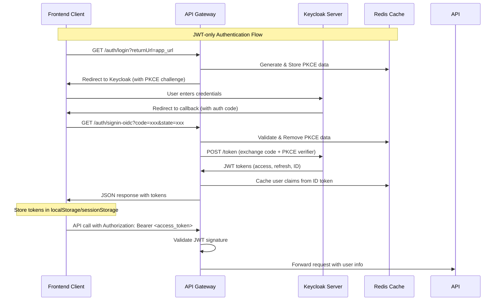

# JWT Authentication Flow - Simplified Approach

Hướng dẫn chi tiết về JWT-only authentication flow tại API Gateway, không sử dụng session hoặc cookie.

---

## 🎯 Tổng quan

Kiến trúc mới sử dụng **JWT-only approach** với các đặc điểm:

✅ **Stateless**: Không lưu trữ session ở server  
✅ **JWT Tokens**: Trả trực tiếp access_token và refresh_token  
✅ **Claims Caching**: Cache user claims từ ID token thay vì session  
✅ **PKCE Security**: Vẫn sử dụng PKCE cho OAuth 2.0 security  

---

## 🔄 Authentication Flow



---

## 📋 Endpoints

### 1. Initiate Login
```http
GET /auth/login?returnUrl={redirect_after_login}
```

**Response**: Redirect to Keycloak authorization URL

### 2. OAuth Callback (Returns JWT)
```http
GET /auth/signin-oidc?code={auth_code}&state={pkce_state}
```

**Response**:
```json
{
  "access_token": "eyJhbGciOiJSUzI1NiIsInR5cCI6IkpXVCJ9...",
  "refresh_token": "eyJhbGciOiJIUzI1NiIsInR5cCIgOiAiSldUIiwia2lkIjoiYWQ5...",
  "token_type": "Bearer",
  "expires_in": 3600,
  "redirect_url": "http://localhost:3000/dashboard"
}
```

### 3. Refresh Token
```http
POST /auth/refresh
Content-Type: application/json

{
  "refresh_token": "eyJhbGciOiJIUzI1NiIsInR5cCIgOiAiSldUIiwia2lkIjoiYWQ5..."
}
```

**Response**: New access_token và refresh_token

### 4. Logout
```http
POST /auth/logout
Content-Type: application/json

{
  "refresh_token": "eyJhbGciOiJIUzI1NiIsInR5cCIgOiAiSldUIiwia2lkIjoiYWQ5...",
  "user_id": "12345-uuid"
}
```

**Response**: 
```json
{
  "message": "Logged out successfully"
}
```

### 5. Get Cached User Claims
```http
GET /auth/user/{userId}
```

**Response**:
```json
{
  "user_id": "12345-uuid",
  "username": "john.doe",
  "email": "john@example.com",
  "roles": ["user", "admin"],
  "claims": {
    "name": "John Doe",
    "picture": "https://example.com/avatar.jpg"
  },
  "cached_at": "2026-01-19T10:00:00Z",
  "expires_at": "2026-01-19T11:00:00Z"
}
```

---

## 🔒 Security Features

### PKCE (Proof Key for Code Exchange)
- **Code Verifier**: Random 43-128 chars string
- **Code Challenge**: SHA256 hash của verifier
- **State Parameter**: Random string for CSRF protection
- **Expiration**: PKCE data expires sau 10 phút

### JWT Token Security
- **Access Token**: Short-lived (1 hour), used for API calls
- **Refresh Token**: Long-lived, used để lấy access token mới
- **ID Token**: Chứa user claims, được cache sau khi verify

### Claims Caching
- **Storage**: Redis với key pattern `user_claims:{userId}`
- **Expiration**: Sliding expiration (mặc định 60 phút)
- **Data**: User info extract từ ID token

---

## 💻 Frontend Integration

### Storing Tokens
```javascript
// Sau khi nhận tokens từ callback
localStorage.setItem('access_token', response.access_token);
localStorage.setItem('refresh_token', response.refresh_token);

// Hoặc sessionStorage cho session-only storage
sessionStorage.setItem('access_token', response.access_token);
```

### API Calls với JWT
```javascript
const accessToken = localStorage.getItem('access_token');

const response = await fetch('/api/protected-endpoint', {
  headers: {
    'Authorization': `Bearer ${accessToken}`,
    'Content-Type': 'application/json'
  }
});

if (response.status === 401) {
  // Token expired, refresh hoặc redirect to login
  await refreshToken();
}
```

### Auto Token Refresh
```javascript
async function refreshToken() {
  const refreshToken = localStorage.getItem('refresh_token');
  
  const response = await fetch('/auth/refresh', {
    method: 'POST',
    headers: { 'Content-Type': 'application/json' },
    body: JSON.stringify({ refresh_token: refreshToken })
  });

  if (response.ok) {
    const tokens = await response.json();
    localStorage.setItem('access_token', tokens.access_token);
    localStorage.setItem('refresh_token', tokens.refresh_token);
    return tokens.access_token;
  } else {
    // Refresh failed, redirect to login
    window.location.href = '/auth/login';
  }
}
```

---

## 🔧 Configuration

### OAuth Options
```json
{
  "OAuth": {
    "Authority": "http://localhost:8080/realms/master",
    "ClientId": "your-client-id",
    "ClientSecret": "your-client-secret",
    "RedirectUri": "/auth/signin-oidc",
    "UsePkce": true,
    "Scopes": ["openid", "profile", "email"],
    "WebAppUrl": "http://localhost:3000"
  }
}
```

### Redis Cache Settings
```json
{
  "ConnectionStrings": {
    "Redis": "localhost:6379"
  },
  "UserClaimsCache": {
    "DefaultExpirationMinutes": 60,
    "SlidingExpiration": true
  }
}
```

---

## 🚨 Error Handling

### Common Error Responses

**Invalid PKCE State**:
```json
{
  "error": "invalid_state",
  "message": "Invalid or expired state parameter"
}
```

**Token Refresh Failed**:
```json
{
  "error": "refresh_failed", 
  "message": "Invalid refresh token"
}
```

**User Claims Not Found**:
```json
{
  "error": "user_not_found",
  "message": "User claims not found in cache"
}
```

---

## 📊 Benefits

**So với Session-based approach:**

✅ **Đơn giản hơn**: Không cần quản lý session lifecycle  
✅ **Scalable**: Stateless, dễ scale horizontal  
✅ **Performance**: Giảm Redis queries (chỉ cache claims)  
✅ **Standards**: Tuân thủ OAuth 2.0 / OpenID Connect standards  
✅ **Mobile-friendly**: JWT tokens dễ sử dụng trên mobile apps  

**Trade-offs:**

⚠️ **Frontend complexity**: Cần handle token storage và refresh  
⚠️ **Token size**: Access tokens lớn hơn session IDs  
⚠️ **Revocation**: Khó revoke access tokens ngay lập tức  