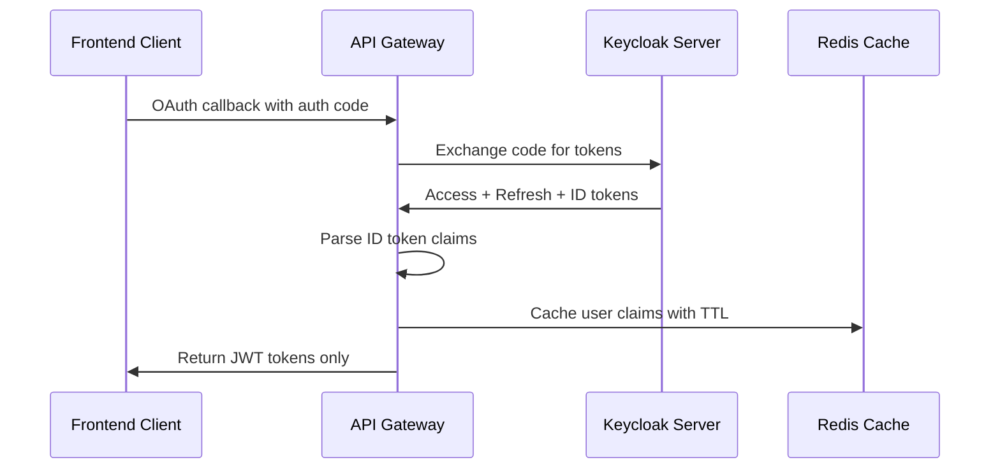
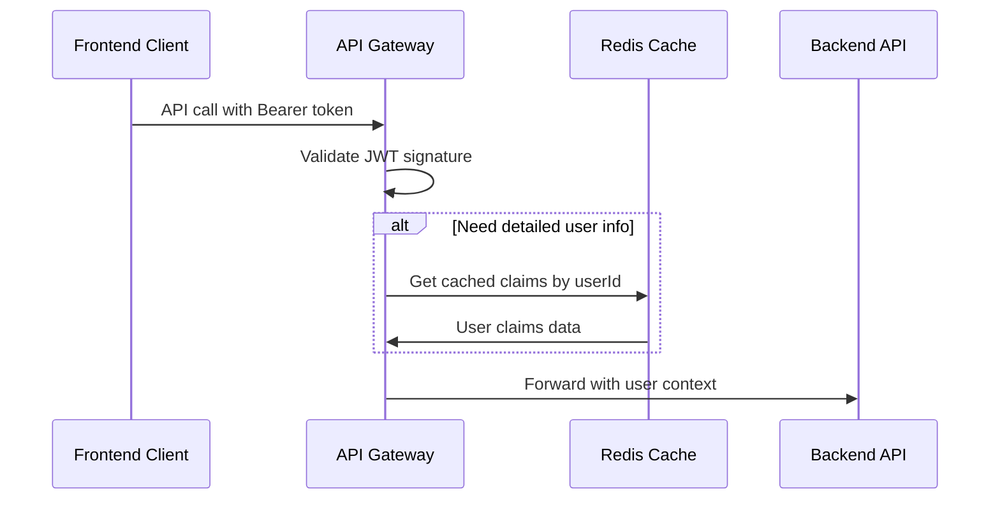

# User Claims Caching - Thay thế Session Management

Hướng dẫn về cách cache user claims từ JWT tokens thay vì sử dụng session management.

---

## 🎯 Tổng quan

**User Claims Caching** là cách tiếp cận mới thay thế Session Management trong JWT-only authentication:

### Session-based (Old) ❌
```
User Login → Create Session → Store in Redis
API Call → Check Session → Get User Info
```

### Claims-based (New) ✅
```
User Login → Extract Claims from ID Token → Cache Claims in Redis
API Call → Validate JWT → Get Claims from Cache (optional)
```

---

## 🔄 How It Works

### 1. Login Flow với Claims Caching



### 2. API Call với Cached Claims



---

## 🏗️ Implementation

### IUserClaimsCache Interface

```csharp
public interface IUserClaimsCache
{
    Task CacheUserClaimsAsync(string idToken, int expirationMinutes = 60);
    Task<CachedUserClaims?> GetUserClaimsAsync(string userId);
    Task RemoveUserClaimsAsync(string userId);
    Task<bool> IsUserClaimsValidAsync(string userId);
}
```

### CachedUserClaims Model

```csharp
public class CachedUserClaims
{
    public string UserId { get; set; } = string.Empty;
    public string Username { get; set; } = string.Empty;
    public string Email { get; set; } = string.Empty;
    public List<string> Roles { get; set; } = new();
    public Dictionary<string, string> Claims { get; set; } = new();
    public DateTime CachedAt { get; set; }
    public DateTime ExpiresAt { get; set; }
    
    public bool IsExpired() => DateTime.UtcNow >= ExpiresAt;
}
```

---

## 📋 Sử dụng trong AuthController

### Khi Login (Cache Claims)

```csharp
[HttpGet("signin-oidc")]
public async Task<IActionResult> SignInCallback(/*...*/)
{
    // ... OAuth flow ...
    
    var tokenResponse = await _oauthClient.ExchangeCodeForTokensAsync(/*...*/);
    
    // Cache user claims từ ID token
    if (!string.IsNullOrEmpty(tokenResponse.IdToken))
    {
        await _userClaimsCache.CacheUserClaimsAsync(tokenResponse.IdToken);
    }
    
    // Trả JWT tokens
    return Ok(new AuthResponse
    {
        AccessToken = tokenResponse.AccessToken,
        RefreshToken = tokenResponse.RefreshToken,
        // ...
    });
}
```

### Khi Logout (Clear Cache)

```csharp
[HttpPost("logout")]
public async Task<IActionResult> Logout([FromBody] LogoutRequest request)
{
    // Revoke tokens
    await _oauthClient.RevokeTokenAsync(request.RefreshToken);
    
    // Remove cached claims
    if (!string.IsNullOrEmpty(request.UserId))
    {
        await _userClaimsCache.RemoveUserClaimsAsync(request.UserId);
    }
    
    return Ok(new { message = "Logged out successfully" });
}
```

### Get User Claims

```csharp
[HttpGet("user/{userId}")]
public async Task<IActionResult> GetUserClaims(string userId)
{
    var userClaims = await _userClaimsCache.GetUserClaimsAsync(userId);
    
    if (userClaims == null)
    {
        return NotFound(new { error = "User claims not found" });
    }
    
    return Ok(userClaims);
}
```

---

## 🗃️ Redis Storage

### Cache Key Pattern
```
user_claims:{userId}
```

### Stored Data Example
```json
{
  "user_id": "a1b2c3d4-e5f6-7890-abcd-ef1234567890",
  "username": "john.doe",
  "email": "john@example.com",
  "roles": ["user", "admin"],
  "claims": {
    "name": "John Doe",
    "given_name": "John",
    "family_name": "Doe",
    "picture": "https://example.com/avatar.jpg",
    "locale": "en-US",
    "email_verified": "true"
  },
  "cached_at": "2026-01-19T10:00:00Z",
  "expires_at": "2026-01-19T11:00:00Z"
}
```

### Cache Configuration
```json
{
  "ConnectionStrings": {
    "Redis": "localhost:6379"
  },
  "UserClaimsCache": {
    "DefaultExpirationMinutes": 60,
    "SlidingExpirationMinutes": 60,
    "MaxAbsoluteExpirationHours": 8
  }
}
```

---

## 🔍 Claims Extraction từ ID Token

### Keycloak ID Token Structure

```json
{
  "sub": "a1b2c3d4-e5f6-7890-abcd-ef1234567890",
  "preferred_username": "john.doe",
  "email": "john@example.com",
  "email_verified": true,
  "name": "John Doe",
  "given_name": "John",
  "family_name": "Doe",
  "realm_access": {
    "roles": ["user", "admin"]
  },
  "resource_access": {
    "your-client": {
      "roles": ["app-user"]
    }
  },
  "iss": "http://localhost:8080/realms/master",
  "aud": "your-client-id",
  "exp": 1737372000,
  "iat": 1737368400
}
```

### Claims Mapping Logic

```csharp
private static List<string> ExtractRoles(IEnumerable<Claim> claims)
{
    var roles = new List<string>();
    
    // Keycloak realm roles
    var realmRoles = claims.FirstOrDefault(c => c.Type == "realm_access")?.Value;
    if (!string.IsNullOrEmpty(realmRoles))
    {
        var realmAccess = JsonDocument.Parse(realmRoles);
        if (realmAccess.RootElement.TryGetProperty("roles", out var rolesElement))
        {
            roles.AddRange(rolesElement.EnumerateArray().Select(r => r.GetString()));
        }
    }
    
    // Standard role claims
    roles.AddRange(claims.Where(c => c.Type == ClaimTypes.Role || c.Type == "role")
                         .Select(c => c.Value));
    
    return roles.Distinct().Where(r => !string.IsNullOrEmpty(r)).ToList();
}
```

---

## ⚡ Performance & Benefits

### So sánh với Session Management

| Aspect | Session-based (Old) | Claims Caching (New) |
|--------|--------------------|--------------------|
| **Storage** | Full session object | Chỉ user claims |
| **Size** | ~2-5KB per session | ~1-2KB per user |
| **Queries** | Mọi API call | On-demand only |
| **Scalability** | Session stickiness | Completely stateless |
| **Cleanup** | Session expiration + rotation | Simple TTL |

### Benefits

✅ **Reduced Redis Traffic**: Chỉ query khi cần thông tin chi tiết user  
✅ **Better Performance**: JWT validation nhanh hơn session lookup  
✅ **Stateless Design**: Server không cần track session state  
✅ **Standard Compliance**: Tuân thủ OAuth 2.0 / OIDC standards  
✅ **Flexible Caching**: Cache chỉ khi cần, TTL linh hoạt  

---

## 🚨 Cache Invalidation Strategies

### 1. Time-based Expiration
```csharp
// Sliding expiration - refresh khi access
var cacheOptions = new DistributedCacheEntryOptions
{
    SlidingExpiration = TimeSpan.FromMinutes(60),
    AbsoluteExpirationRelativeToNow = TimeSpan.FromHours(8)
};
```

### 2. Manual Invalidation
```csharp
// Khi user logout
await _userClaimsCache.RemoveUserClaimsAsync(userId);

// Khi user info thay đổi (từ admin panel)
await _userClaimsCache.RemoveUserClaimsAsync(userId);
// User sẽ được cache lại ở lần login tiếp theo
```

### 3. Batch Cleanup
```csharp
// Background service để cleanup expired claims
public class CacheCleanupService : BackgroundService
{
    protected override async Task ExecuteAsync(CancellationToken stoppingToken)
    {
        while (!stoppingToken.IsCancellationRequested)
        {
            await CleanupExpiredClaims();
            await Task.Delay(TimeSpan.FromHours(1), stoppingToken);
        }
    }
}
```

---

## 🔧 Configuration trong Startup

### Service Registration
```csharp
// Program.cs hoặc Startup.cs
services.AddStackExchangeRedisCache(options =>
{
    options.Configuration = configuration.GetConnectionString("Redis");
});

services.AddScoped<IUserClaimsCache, UserClaimsCache>();
```

### JWT Authentication Setup
```csharp
services.AddAuthentication(JwtBearerDefaults.AuthenticationScheme)
    .AddJwtBearer(options =>
    {
        options.Authority = configuration["OAuth:Authority"];
        options.Audience = configuration["OAuth:ClientId"];
        options.RequireHttpsMetadata = false; // Dev only
        
        options.Events = new JwtBearerEvents
        {
            OnTokenValidated = async context =>
            {
                // Optional: Load additional claims from cache
                var userId = context.Principal?.FindFirst("sub")?.Value;
                if (!string.IsNullOrEmpty(userId))
                {
                    var claimsCache = context.HttpContext.RequestServices
                        .GetRequiredService<IUserClaimsCache>();
                    var cachedClaims = await claimsCache.GetUserClaimsAsync(userId);
                    
                    // Add cached claims to principal if needed
                }
            }
        };
    });
```

---

## 🔄 Migration từ Session-based

### Step 1: Deploy Claims Caching
- Thêm `IUserClaimsCache` service
- Update login flow để cache claims
- Giữ nguyên session logic song song

### Step 2: Update Frontend
- Store JWT tokens thay vì rely on cookies
- Implement token refresh logic
- Update API calls để sử dụng Bearer tokens

### Step 3: Remove Session Management
- Xóa session-related endpoints
- Remove session middleware
- Cleanup session storage trong Redis

### Step 4: Monitoring & Optimization
- Monitor cache hit rates
- Optimize cache TTL dựa trên usage patterns
- Setup alerts cho cache errors