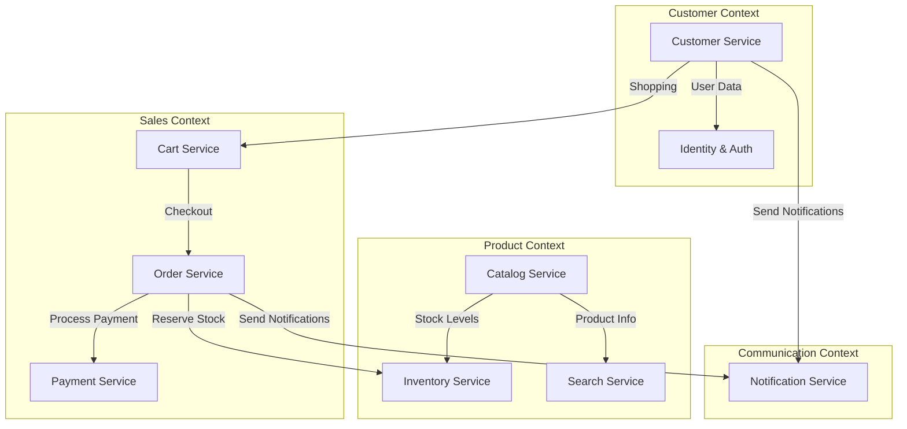

# E-commerce Platform - Domain Model & Bounded Contexts

## Overview

The e-commerce platform follows Domain-Driven Design (DDD) principles with clear bounded contexts that align with our microservices architecture. Each bounded context encapsulates a specific business domain with its own ubiquitous language, data models, and business rules.

## Bounded Context Map



## 1. Customer Context

### Purpose
Manages customer identity, profiles, and authentication concerns.

### Core Entities

#### Customer Aggregate
```csharp
public class Customer : AggregateRoot<CustomerId>
{
    public Email Email { get; private set; }
    public PersonName Name { get; private set; }
    public Phone Phone { get; private set; }
    public CustomerStatus Status { get; private set; }
    public DateTime CreatedAt { get; private set; }
    public List<Address> Addresses { get; private set; }
    public CustomerPreferences Preferences { get; private set; }
    
    // Domain Events
    public void Register(Email email, PersonName name)
    public void UpdateProfile(PersonName name, Phone phone)
    public void AddAddress(Address address)
    public void SetPreferences(CustomerPreferences preferences)
}
```

#### Value Objects
```csharp
public record CustomerId(Guid Value);
public record Email(string Value);
public record PersonName(string FirstName, string LastName);
public record Phone(string Value);
public record Address(string Street, string City, string State, string PostalCode, string Country);
```

#### Domain Events
- `CustomerRegistered`
- `CustomerProfileUpdated` 
- `CustomerAddressAdded`
- `CustomerPreferencesChanged`

### Ubiquitous Language
- **Customer**: A person who can purchase products
- **Profile**: Customer's personal information and preferences
- **Address**: Physical location for shipping
- **Preferences**: Customer's shopping and communication preferences

---

## 2. Product Context

### Purpose
Manages product catalog, categories, inventory, and search capabilities.

### Core Entities

#### Product Aggregate
```csharp
public class Product : AggregateRoot<ProductId>
{
    public string Name { get; private set; }
    public string Description { get; private set; }
    public string Slug { get; private set; }
    public string SKU { get; private set; }
    public CategoryId CategoryId { get; private set; }
    public Money Price { get; private set; }
    public Money ComparePrice { get; private set; }
    public ProductStatus Status { get; private set; }
    public List<ProductVariant> Variants { get; private set; }
    public List<ProductImage> Images { get; private set; }
    public ProductAttributes Attributes { get; private set; }
    public DateTime CreatedAt { get; private set; }
    
    // Domain Methods
    public void UpdatePricing(Money price, Money comparePrice)
    public void AddVariant(ProductVariant variant)
    public void UpdateInventory(ProductVariantId variantId, int quantity)
    public void Publish()
    public void Archive()
}
```

#### Category Aggregate
```csharp
public class Category : AggregateRoot<CategoryId>
{
    public string Name { get; private set; }
    public string Slug { get; private set; }
    public string Description { get; private set; }
    public CategoryId? ParentId { get; private set; }
    public CategoryStatus Status { get; private set; }
    public int DisplayOrder { get; private set; }
    public List<CategoryId> ChildCategories { get; private set; }
    
    // Domain Methods
    public void AddChildCategory(Category child)
    public void UpdateHierarchy(CategoryId? newParentId)
    public void Reorder(int newDisplayOrder)
}
```

#### Inventory Aggregate
```csharp
public class InventoryItem : AggregateRoot<InventoryItemId>
{
    public ProductVariantId ProductVariantId { get; private set; }
    public int QuantityAvailable { get; private set; }
    public int QuantityReserved { get; private set; }
    public int LowStockThreshold { get; private set; }
    public DateTime LastUpdated { get; private set; }
    
    // Domain Methods
    public bool CanReserve(int quantity)
    public void Reserve(int quantity, OrderId orderId)
    public void Release(int quantity, OrderId orderId)
    public void Adjust(int quantity, string reason)
    public bool IsLowStock()
}
```

### Value Objects
```csharp
public record ProductId(Guid Value);
public record CategoryId(Guid Value);
public record ProductVariantId(Guid Value);
public record Money(decimal Amount, string Currency);
public record ProductAttributes(Dictionary<string, string> Attributes);
```

### Domain Events
- `ProductCreated`
- `ProductUpdated`
- `ProductPublished`
- `ProductArchived`
- `InventoryReserved`
- `InventoryReleased`
- `LowStockAlert`
- `CategoryCreated`
- `CategoryHierarchyChanged`

### Ubiquitous Language
- **Product**: An item that can be sold
- **Variant**: A specific configuration of a product (size, color, etc.)
- **SKU**: Stock Keeping Unit, unique identifier for a variant
- **Category**: Product classification for organization
- **Inventory**: Available stock for products
- **Reservation**: Temporarily allocated stock for orders

---

## 3. Sales Context

### Purpose
Manages the customer's shopping journey from cart to completed order and payment.

### Core Entities

#### Cart Aggregate
```csharp
public class ShoppingCart : AggregateRoot<CartId>
{
    public CustomerId? CustomerId { get; private set; } // null for guest
    public string SessionId { get; private set; }
    public List<CartItem> Items { get; private set; }
    public Money Subtotal { get; private set; }
    public DateTime CreatedAt { get; private set; }
    public DateTime LastModified { get; private set; }
    public DateTime? ExpiresAt { get; private set; }
    
    // Domain Methods
    public void AddItem(ProductVariantId variantId, int quantity, Money unitPrice)
    public void UpdateItemQuantity(CartItemId itemId, int quantity)
    public void RemoveItem(CartItemId itemId)
    public void ApplyDiscount(DiscountCode code)
    public void ConvertToOrder()
    public void Abandon()
}
```

#### Order Aggregate
```csharp
public class Order : AggregateRoot<OrderId>
{
    public string OrderNumber { get; private set; }
    public CustomerId CustomerId { get; private set; }
    public OrderStatus Status { get; private set; }
    public List<OrderItem> Items { get; private set; }
    public Money Subtotal { get; private set; }
    public Money TaxAmount { get; private set; }
    public Money ShippingAmount { get; private set; }
    public Money TotalAmount { get; private set; }
    public Address ShippingAddress { get; private set; }
    public Address BillingAddress { get; private set; }
    public PaymentInfo PaymentInfo { get; private set; }
    public ShippingInfo ShippingInfo { get; private set; }
    public DateTime CreatedAt { get; private set; }
    
    // Domain Methods
    public void Confirm(PaymentId paymentId)
    public void Ship(string trackingNumber, string carrier)
    public void Deliver()
    public void Cancel(string reason)
    public void Refund(Money amount, string reason)
}
```

#### Payment Aggregate
```csharp
public class Payment : AggregateRoot<PaymentId>
{
    public OrderId OrderId { get; private set; }
    public Money Amount { get; private set; }
    public string PaymentMethod { get; private set; }
    public PaymentStatus Status { get; private set; }
    public string ExternalTransactionId { get; private set; }
    public DateTime ProcessedAt { get; private set; }
    public PaymentProvider Provider { get; private set; }
    
    // Domain Methods
    public void Authorize(Money amount)
    public void Capture()
    public void Refund(Money amount)
    public void Fail(string reason)
}
```

### Value Objects
```csharp
public record CartId(Guid Value);
public record OrderId(Guid Value);
public record PaymentId(Guid Value);
public record OrderNumber(string Value);
public record DiscountCode(string Code, decimal Amount);
```

### Domain Events
- `ItemAddedToCart`
- `ItemRemovedFromCart`
- `CartAbandoned`
- `OrderCreated`
- `OrderConfirmed`
- `OrderShipped`
- `OrderDelivered`
- `OrderCancelled`
- `PaymentAuthorized`
- `PaymentCaptured`
- `PaymentFailed`
- `RefundProcessed`

### Ubiquitous Language
- **Cart**: Collection of items customer intends to purchase
- **Order**: Confirmed purchase request from customer
- **Payment**: Financial transaction for order
- **Authorization**: Reserving payment amount
- **Capture**: Actually charging the payment
- **Fulfillment**: Process of delivering order to customer

---

## 4. Communication Context

### Purpose
Manages notifications, communications, and messaging across the platform.

### Core Entities

#### Notification Aggregate
```csharp
public class Notification : AggregateRoot<NotificationId>
{
    public RecipientId RecipientId { get; private set; }
    public NotificationType Type { get; private set; }
    public NotificationChannel Channel { get; private set; }
    public string Subject { get; private set; }
    public string Content { get; private set; }
    public NotificationStatus Status { get; private set; }
    public Dictionary<string, object> Metadata { get; private set; }
    public DateTime CreatedAt { get; private set; }
    public DateTime? SentAt { get; private set; }
    
    // Domain Methods
    public void Send()
    public void MarkDelivered()
    public void MarkFailed(string reason)
    public void Retry()
}
```

### Domain Events
- `NotificationCreated`
- `NotificationSent`
- `NotificationDelivered`
- `NotificationFailed`

### Ubiquitous Language
- **Notification**: Message sent to customer
- **Channel**: Method of delivery (email, SMS, push)
- **Template**: Reusable message format
- **Recipient**: Target of notification

---

## Cross-Context Integration Patterns

### 1. Shared Kernel
Common value objects and base classes are shared across contexts:
- `Money`
- `Address`
- `AggregateRoot<T>`
- `DomainEvent`
- `EntityId<T>`

### 2. Customer-Supplier Relationships
- **Product Context** → **Sales Context**: Product information flows to cart/order
- **Sales Context** → **Product Context**: Inventory reservations flow back
- **Sales Context** → **Communication Context**: Order events trigger notifications

### 3. Published Events
Integration events published via message bus:
```csharp
public class OrderCreatedIntegrationEvent
{
    public Guid OrderId { get; set; }
    public Guid CustomerId { get; set; }
    public List<OrderItemDto> Items { get; set; }
    public decimal TotalAmount { get; set; }
    public DateTime CreatedAt { get; set; }
}
```

## Anti-Corruption Layers

Each service maintains anti-corruption layers when consuming data from other contexts:

```csharp
public interface IProductCatalogAdapter
{
    Task<ProductInfo> GetProductInfoAsync(ProductVariantId variantId);
    Task<bool> IsProductAvailableAsync(ProductVariantId variantId, int quantity);
}

public interface ICustomerProfileAdapter  
{
    Task<CustomerInfo> GetCustomerInfoAsync(CustomerId customerId);
    Task<List<Address>> GetCustomerAddressesAsync(CustomerId customerId);
}
```

## Domain Services

Cross-aggregate operations are handled by domain services:

```csharp
public class OrderCreationService
{
    private readonly IInventoryService _inventoryService;
    private readonly IPricingService _pricingService;
    
    public async Task<Order> CreateOrderFromCartAsync(ShoppingCart cart, Address shippingAddress)
    {
        // Coordinate across aggregates to create order
        // Validate inventory availability
        // Calculate final pricing
        // Reserve inventory
        // Create order
    }
}
```

This domain model provides clear boundaries, consistent terminology, and well-defined responsibilities that align with our microservices architecture while maintaining domain integrity within each bounded context.