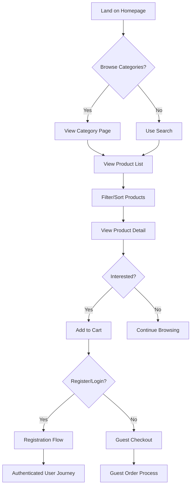
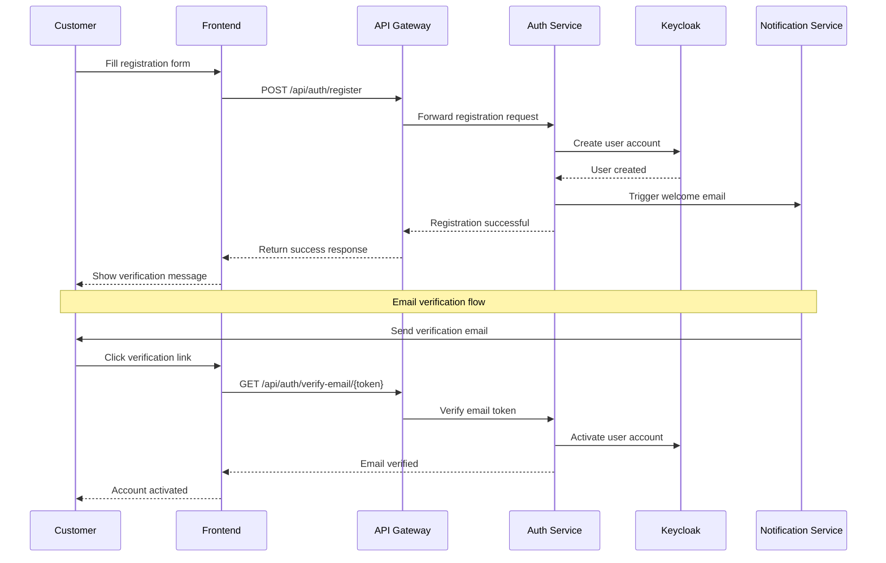
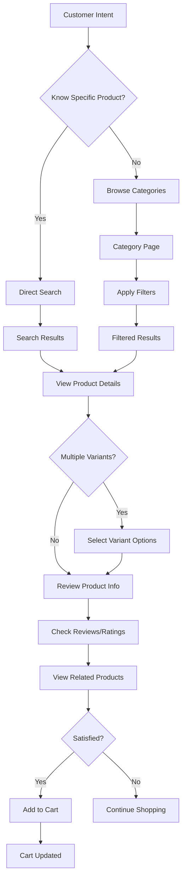
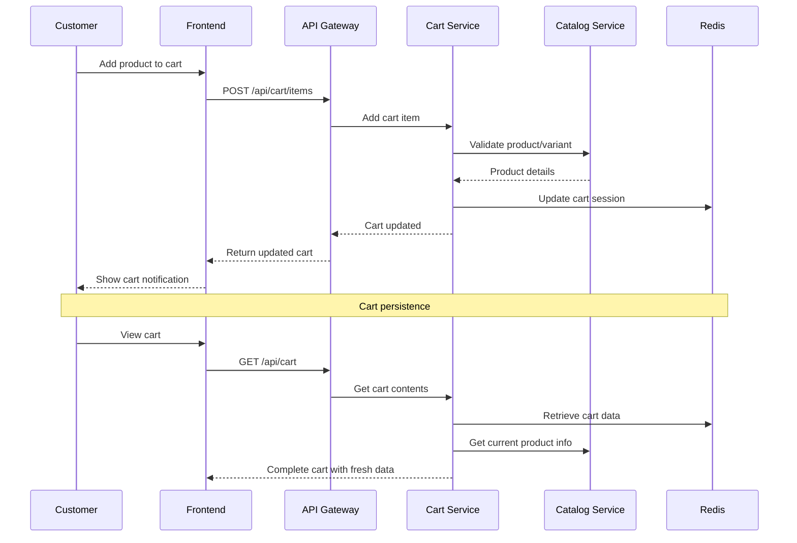
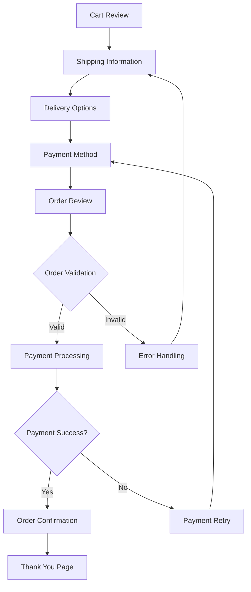
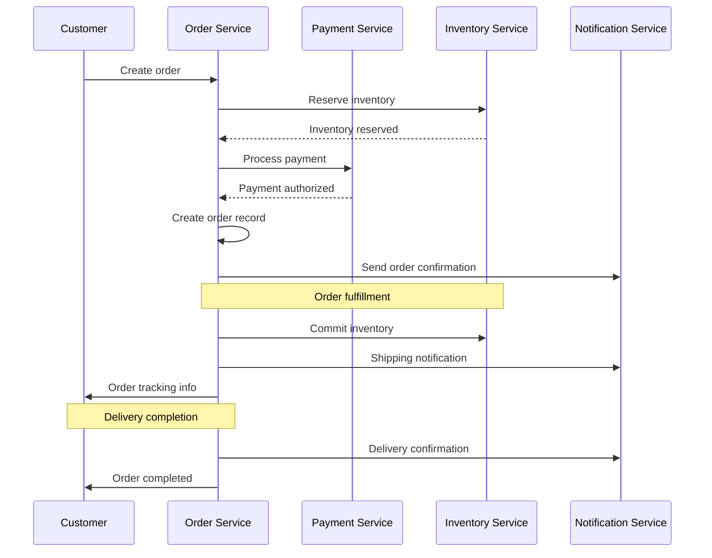
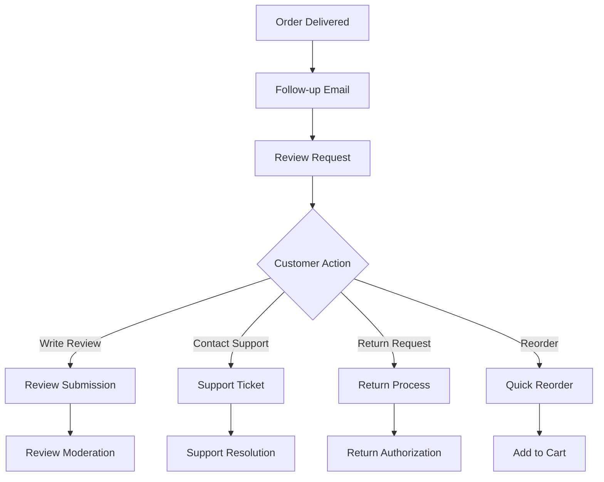
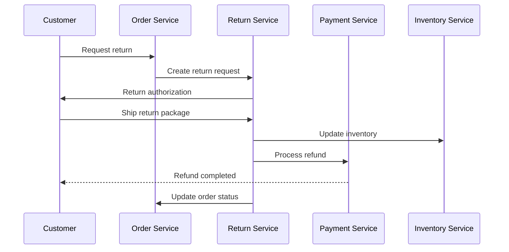

# E-commerce Platform - Customer Journey

## Overview

This document outlines the complete customer journey through the e-commerce platform, from initial discovery to post-purchase support. Understanding these workflows is crucial for designing user-centered microservices and ensuring seamless customer experiences.

## Customer Journey Stages

### 1. Discovery & Browsing

#### Anonymous User Journey

#### Key Touchpoints
- **Homepage**: Brand presentation, featured products, category navigation
- **Category Pages**: Product organization, filtering, comparison
- **Search Results**: Relevant product discovery, suggestion system
- **Product Details**: Comprehensive product information, reviews, recommendations

#### User Experience Requirements
- **Page Load Time**: < 3 seconds for all pages
- **Mobile Responsive**: Seamless experience across devices
- **Search Quality**: Relevant results with auto-suggestions
- **Navigation**: Intuitive category hierarchy and breadcrumbs

### 2. Registration & Authentication

#### Registration Flow

#### Authentication Options
1. **Email/Password**: Traditional authentication with strong password requirements
2. **Social Login**: Google, Facebook, Apple integration
3. **Multi-Factor Authentication**: Optional SMS/authenticator app
4. **Guest Checkout**: Order without account creation

#### Security Considerations
- **Password Policy**: Minimum 8 characters, mixed case, numbers, special chars
- **Account Lockout**: After 5 failed attempts, 15-minute lockout
- **Session Management**: 30-minute idle timeout, secure cookie handling
- **Email Verification**: Required for account activation

### 3. Product Discovery & Selection

#### Search & Browse Workflow

#### Product Information Requirements
- **Basic Details**: Name, description, price, availability
- **Variant Options**: Size, color, style with pricing differences
- **Media**: High-quality images, videos, 360° views
- **Specifications**: Technical details, dimensions, materials
- **Reviews**: Customer ratings, written reviews, verified purchases
- **Social Proof**: Purchase history, recommendations

### 4. Shopping Cart Management

#### Cart Interaction Flow

#### Cart Features
- **Quantity Management**: Easy increment/decrement with validation
- **Item Removal**: One-click removal with undo option
- **Save for Later**: Move items to wishlist
- **Price Updates**: Real-time pricing and availability
- **Cross-sell**: Recommended products and bundles
- **Cart Persistence**: Maintain cart across sessions

#### Cart Business Rules
- **Inventory Validation**: Check availability before adding
- **Price Protection**: Honor prices for limited time
- **Quantity Limits**: Maximum per product/per customer
- **Cart Expiry**: Guest carts expire after 7 days

### 5. Checkout Process

#### Multi-Step Checkout Flow

#### Checkout Steps Detail

##### Step 1: Shipping Information
- **Guest Users**: Email, phone, shipping address
- **Registered Users**: Select from saved addresses or add new
- **Address Validation**: Real-time validation, suggestions
- **Special Instructions**: Delivery notes, access codes

##### Step 2: Delivery Options
- **Shipping Methods**: Standard, expedited, overnight
- **Cost Calculation**: Real-time shipping cost based on location
- **Delivery Estimates**: Accurate delivery date ranges
- **Store Pickup**: Local pickup options if available

##### Step 3: Payment Method
- **Saved Cards**: Previously stored payment methods
- **New Payment**: Credit/debit card, digital wallets
- **Alternative Payments**: PayPal, buy now pay later
- **Security**: PCI compliance, 3D Secure authentication

##### Step 4: Order Review
- **Item Summary**: Products, quantities, prices
- **Cost Breakdown**: Subtotal, taxes, shipping, discounts
- **Addresses**: Shipping and billing confirmation
- **Terms**: Privacy policy, terms of service agreement

### 6. Order Processing Workflow

#### Order Creation & Fulfillment

#### Order Status Lifecycle
1. **Pending**: Order created, awaiting payment
2. **Confirmed**: Payment processed successfully
3. **Processing**: Order being prepared for shipment
4. **Shipped**: Order dispatched to customer
5. **Delivered**: Order received by customer
6. **Completed**: Order fulfillment finished
7. **Cancelled**: Order cancelled (before shipping)
8. **Returned**: Order returned by customer

### 7. Post-Purchase Experience

#### Customer Support & Engagement

#### Post-Purchase Touchpoints
- **Order Confirmation**: Immediate email with order details
- **Shipping Updates**: Tracking information and delivery estimates
- **Delivery Confirmation**: Arrival notification
- **Review Request**: Follow-up email requesting product review
- **Support Access**: Easy access to customer service
- **Reorder Options**: Quick reorder from order history

### 8. Return & Refund Process

#### Return Workflow

#### Return Policy Guidelines
- **Return Window**: 30 days from delivery
- **Condition Requirements**: Items must be unused, original packaging
- **Refund Processing**: 3-5 business days after receipt
- **Exchange Options**: Size/color exchanges when available
- **Return Shipping**: Prepaid labels for defective items

## Customer Segmentation

### Guest Customers
- **Characteristics**: One-time shoppers, price-sensitive
- **Journey Focus**: Quick checkout, trust building
- **Conversion Goals**: Account registration, repeat purchases

### Registered Customers
- **Characteristics**: Return shoppers, brand loyal
- **Journey Focus**: Personalization, convenience
- **Retention Goals**: Loyalty programs, exclusive offers

### Premium Customers
- **Characteristics**: High value, frequent buyers
- **Journey Focus**: VIP experience, priority support
- **Growth Goals**: Increased order value, advocacy

## Mobile Experience Considerations

### Mobile-First Design
- **Touch Optimization**: Large buttons, swipe gestures
- **Single-Hand Usage**: Thumb-friendly navigation
- **Progressive Loading**: Fast initial load, progressive enhancement
- **Offline Capability**: Basic browsing when connectivity is poor

### Mobile-Specific Features
- **Push Notifications**: Order updates, promotional offers
- **Location Services**: Store locator, local delivery
- **Camera Integration**: Visual search, barcode scanning
- **Biometric Authentication**: Fingerprint, face recognition

## Personalization Strategy

### Data Collection Points
- **Browsing Behavior**: Pages viewed, time spent, search queries
- **Purchase History**: Products bought, categories preferred
- **Interaction Data**: Reviews written, support contacts
- **Preference Settings**: Communication preferences, delivery options

### Personalization Applications
- **Product Recommendations**: Based on browsing and purchase history
- **Dynamic Pricing**: Personalized offers and discounts
- **Content Customization**: Relevant categories and promotions
- **Email Marketing**: Targeted campaigns based on behavior

## Analytics & Measurement

### Key Performance Indicators (KPIs)
- **Conversion Rate**: Visitors who complete purchases
- **Cart Abandonment**: Percentage of carts not converted
- **Customer Acquisition Cost**: Cost to acquire new customers
- **Customer Lifetime Value**: Total value per customer
- **Average Order Value**: Average purchase amount

### Journey Analytics
- **Funnel Analysis**: Conversion at each journey stage
- **Drop-off Points**: Where customers abandon the process
- **Path Analysis**: Common navigation patterns
- **Cohort Analysis**: Customer behavior over time

This customer journey documentation provides a comprehensive framework for designing and implementing the e-commerce platform's user experience across all touchpoints and interactions.