# E-commerce Platform - Order Processing Workflow

## Overview

This document details the complete order processing workflow from cart checkout to order fulfillment. The order processing system is the heart of the e-commerce platform, orchestrating multiple services to ensure reliable and efficient order handling.

## Order Processing Architecture

### High-Level Order Flow
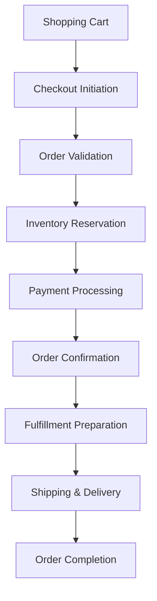

### Service Orchestration
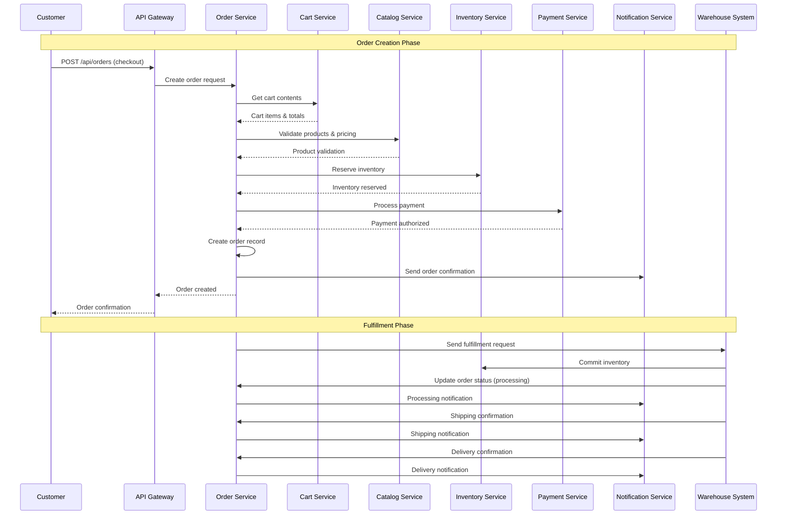

## Order Lifecycle States

### State Diagram
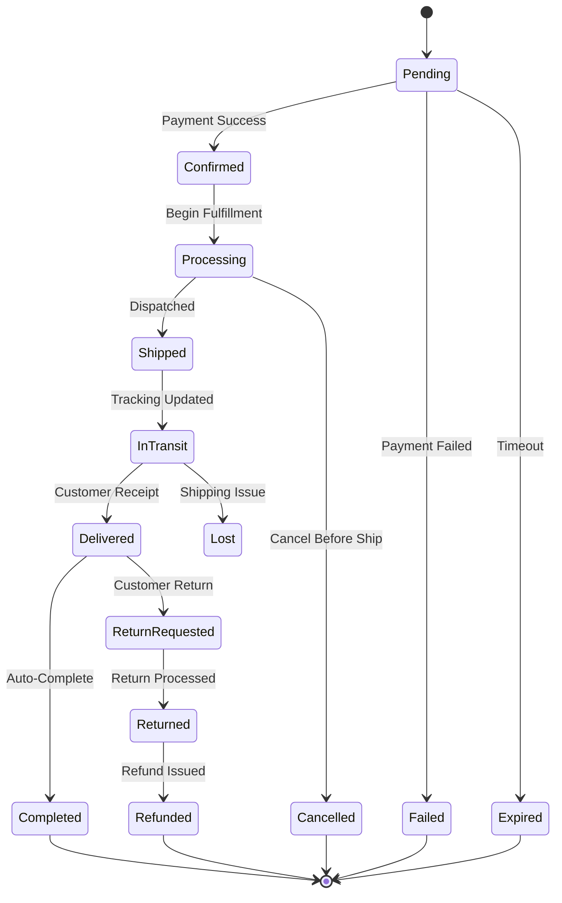

### State Descriptions

#### 1. Pending
- **Description**: Order created, awaiting payment confirmation
- **Duration**: 15 minutes before automatic expiration
- **Actions**: Payment processing, inventory hold
- **Next States**: Confirmed, Failed, Expired

#### 2. Confirmed  
- **Description**: Payment successful, order accepted
- **Triggers**: Payment authorization completed
- **Actions**: Send confirmation email, begin fulfillment
- **Next States**: Processing, Cancelled

#### 3. Processing
- **Description**: Order being prepared for shipment
- **Actions**: Pick items, pack order, generate shipping label
- **Systems**: Warehouse Management System integration
- **Next States**: Shipped, Cancelled

#### 4. Shipped
- **Description**: Order dispatched to customer
- **Triggers**: Shipping confirmation from warehouse
- **Actions**: Update tracking info, notify customer
- **Next States**: InTransit, Delivered

#### 5. InTransit
- **Description**: Order en route to customer
- **Triggers**: Carrier tracking updates
- **Actions**: Track shipment progress, update customer
- **Next States**: Delivered, Lost

#### 6. Delivered
- **Description**: Order received by customer
- **Triggers**: Delivery confirmation or auto-confirmation
- **Actions**: Request review, enable returns
- **Next States**: Completed, ReturnRequested

#### 7. Completed
- **Description**: Order fully fulfilled, no issues
- **Triggers**: 7 days after delivery or customer confirmation
- **Actions**: Final billing, customer satisfaction survey
- **Terminal State**: Yes

## Order Validation Process

### Pre-Order Validation
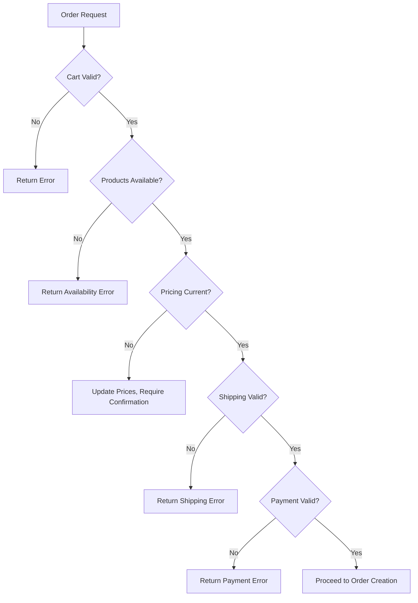

### Validation Rules

#### Cart Validation
- **Non-Empty Cart**: Must contain at least one item
- **Item Availability**: All items must be in stock
- **Quantity Limits**: Respect per-item and per-customer limits
- **Geographic Restrictions**: Items must be available in shipping location

#### Product Validation  
- **Product Status**: Must be active and published
- **Variant Validity**: Selected variants must exist and be active
- **Price Integrity**: Current pricing must match cart pricing
- **Category Restrictions**: Check for age-restricted or regulated products

#### Inventory Validation
- **Stock Availability**: Sufficient quantity available
- **Reservation System**: Temporary hold on inventory
- **Allocation Rules**: Fair allocation during high demand
- **Backorder Handling**: Manage out-of-stock scenarios

#### Payment Validation
- **Payment Method**: Valid and not expired
- **Billing Address**: Matches payment method requirements
- **Fraud Checks**: Risk assessment and validation
- **Amount Verification**: Total matches calculated amount

## Payment Processing Integration

### Payment Flow
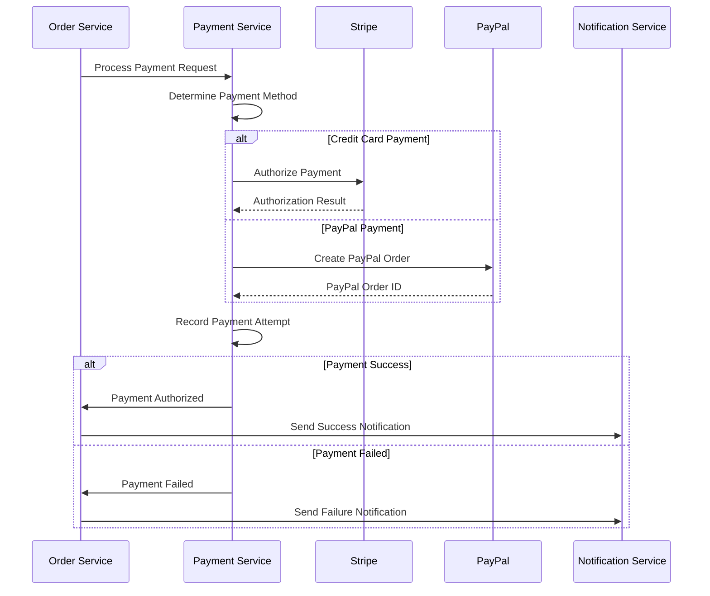

### Payment States
- **Pending**: Payment initiated, awaiting response
- **Authorized**: Payment approved but not captured
- **Captured**: Payment successfully processed
- **Failed**: Payment declined or error occurred
- **Refunded**: Payment returned to customer
- **Partially Refunded**: Partial amount refunded

### Payment Error Handling
- **Insufficient Funds**: Suggest alternative payment methods
- **Card Declined**: Retry with different card
- **Processing Error**: Temporary hold, retry mechanism
- **Fraud Detection**: Additional verification required

## Inventory Management Integration

### Inventory Reservation System
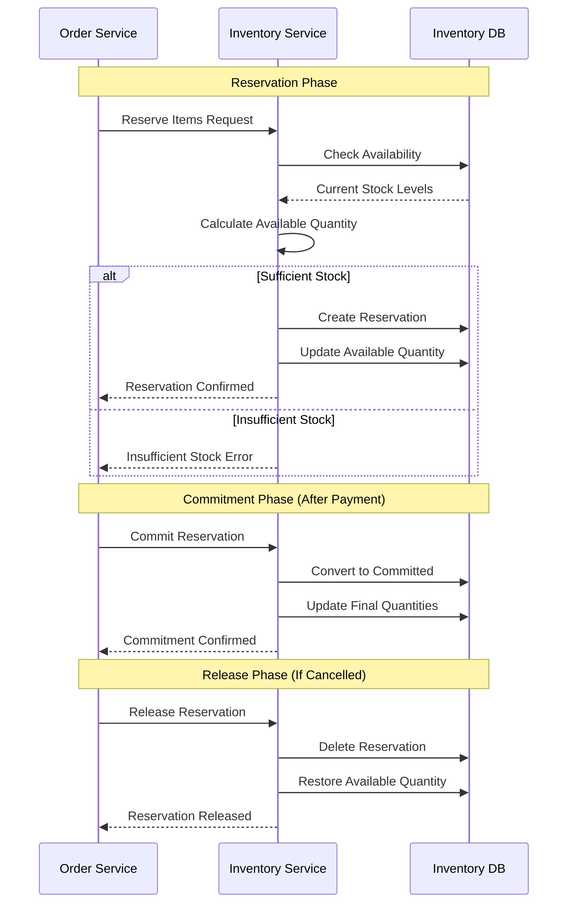

### Inventory Business Rules
- **Reservation Timeout**: 15 minutes for order completion
- **Overselling Prevention**: Never commit more than available
- **Fair Allocation**: First-come, first-served during high demand
- **Safety Stock**: Maintain buffer for operational needs

## Order Saga Pattern Implementation

### Order Processing Saga
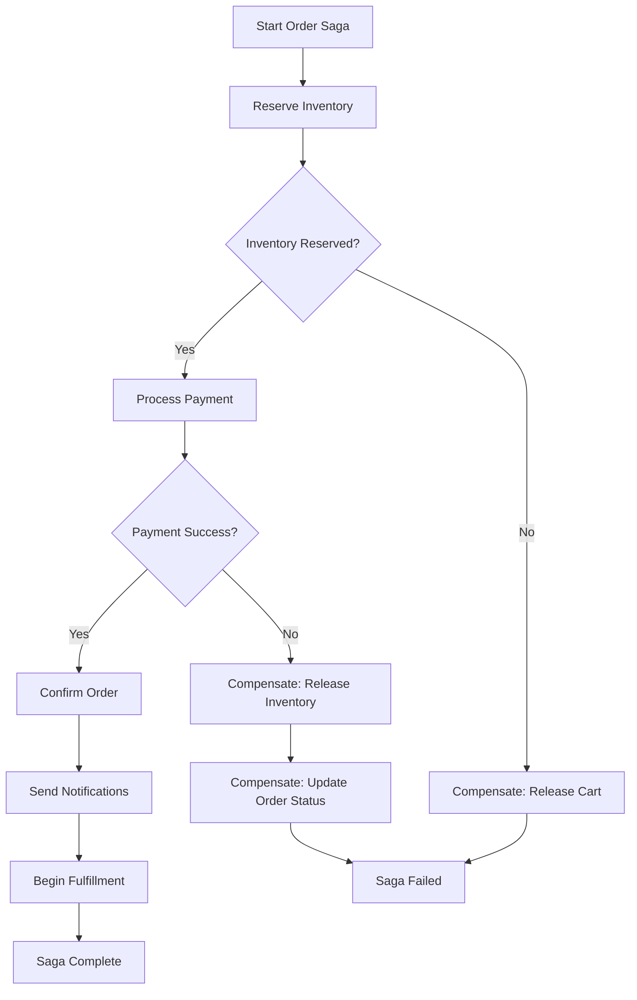

### Compensation Actions
- **Inventory Release**: Return reserved items to available stock
- **Payment Reversal**: Cancel authorization or refund charge
- **Order Cancellation**: Update order status and notify customer
- **Cart Restoration**: Return items to customer's cart

## Fulfillment Workflow

### Warehouse Operations
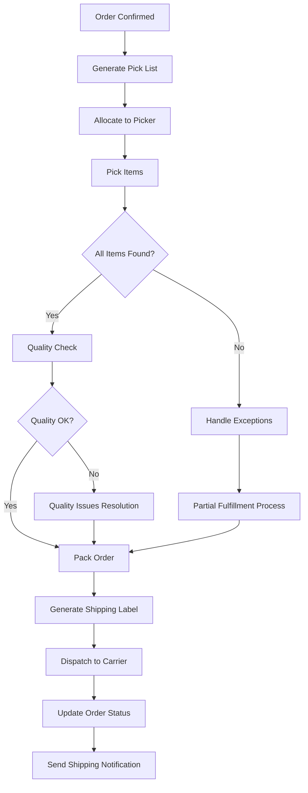

### Exception Handling
- **Item Not Found**: Substitute or partial fulfillment
- **Damaged Inventory**: Replace from available stock
- **Quality Issues**: Escalate to quality team
- **Packaging Problems**: Repack or use alternative packaging

## Shipping & Logistics

### Carrier Integration
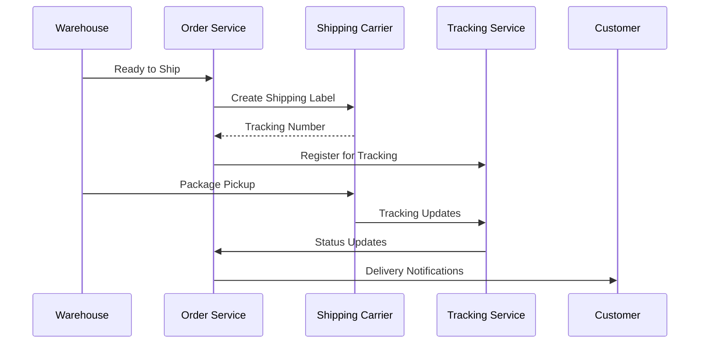

### Shipping Options
- **Standard Shipping**: 3-5 business days
- **Expedited Shipping**: 1-2 business days  
- **Overnight Shipping**: Next business day
- **Local Delivery**: Same day in select areas
- **Store Pickup**: Customer collection option

### Tracking Integration
- **Real-time Updates**: Carrier API integration
- **Proactive Notifications**: Email/SMS updates
- **Delivery Exceptions**: Delayed or failed delivery handling
- **Delivery Confirmation**: Photo proof or signature

## Order Modification & Cancellation

### Modification Windows
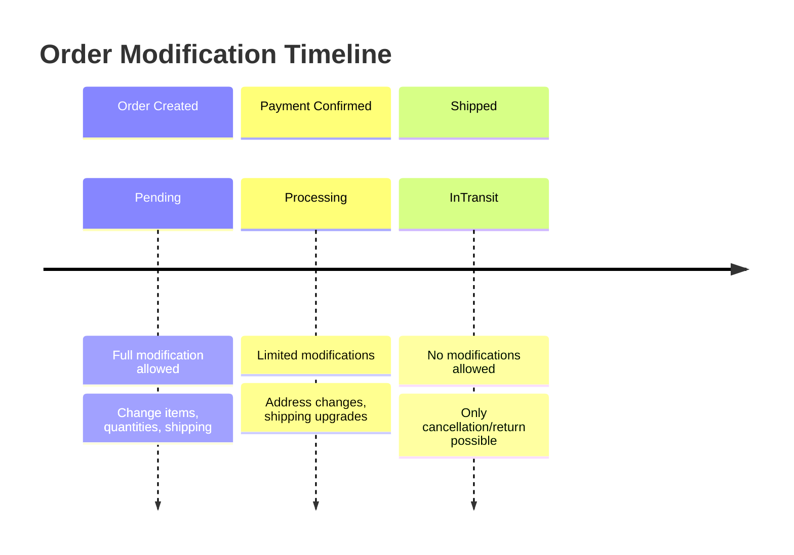

### Modification Types
- **Add Items**: Append additional products to order
- **Remove Items**: Cancel specific items before shipping
- **Quantity Changes**: Increase or decrease item quantities
- **Address Updates**: Modify shipping or billing address
- **Shipping Upgrades**: Change to faster shipping method

### Cancellation Process
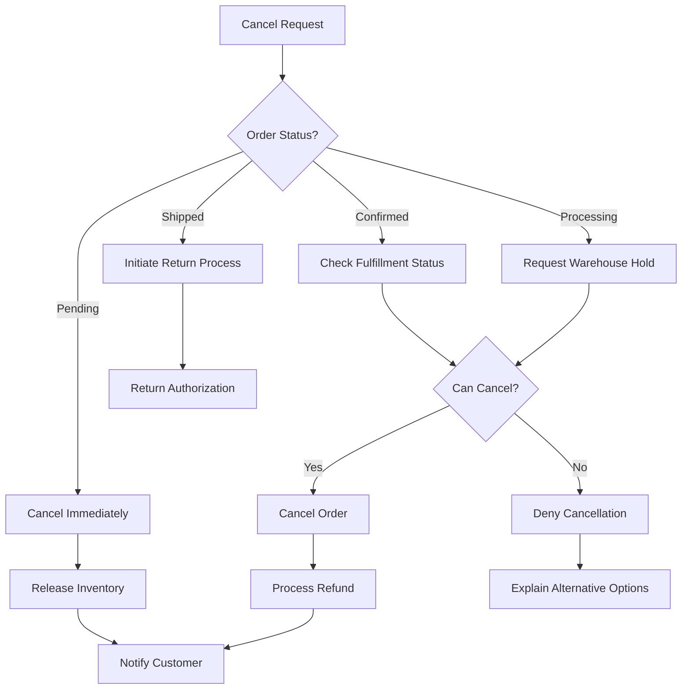

## Order Analytics & Reporting

### Key Metrics
- **Order Conversion Rate**: Cart-to-order conversion
- **Average Order Value**: Mean order amount
- **Order Processing Time**: Time from order to shipment
- **Fulfillment Accuracy**: Correct orders percentage
- **Delivery Performance**: On-time delivery rate

### Real-time Monitoring
- **Order Volume**: Current order processing load
- **Inventory Levels**: Stock availability monitoring
- **Payment Success Rate**: Payment processing health
- **Fulfillment Capacity**: Warehouse processing capability

### Reporting Dashboards
- **Daily Order Summary**: Volume, revenue, status distribution
- **Fulfillment Performance**: Processing times, accuracy rates
- **Customer Satisfaction**: Order ratings, complaint analysis
- **Financial Reconciliation**: Payments, refunds, adjustments

This comprehensive order processing workflow ensures reliable, scalable, and customer-focused order management across the entire e-commerce platform.