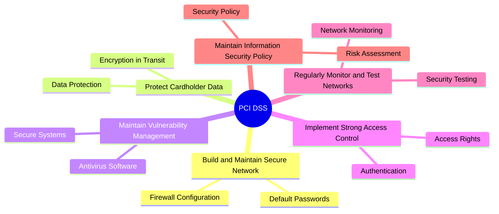

# E-commerce Platform - Payment Processing Workflow

## Overview

This document outlines the complete payment processing workflow for the e-commerce platform, including multiple payment methods, security measures, fraud prevention, and integration with various payment providers. The payment system is designed to be secure, reliable, and compliant with industry standards.

## Payment Architecture

### High-Level Payment Flow

### Payment Service Integration

## Payment Methods

### 1. Credit/Debit Cards

#### Supported Card Types
- **Visa**: All regions, comprehensive fraud protection
- **Mastercard**: Global acceptance, advanced security features
- **American Express**: Premium customer support
- **Discover**: US market focus
- **JCB**: Asian market coverage
- **Diners Club**: Corporate and travel cards

#### Card Processing Flow

#### Security Features
- **PCI DSS Compliance**: Level 1 certification required
- **Tokenization**: Card data never stored locally
- **3D Secure**: Additional authentication layer
- **CVV Verification**: Card security code validation
- **Address Verification**: AVS for fraud prevention

### 2. Digital Wallets

#### PayPal Integration

#### Apple Pay Integration

#### Google Pay Integration
- **Android Integration**: Native Google Pay SDK
- **Web Integration**: Google Pay API for web
- **Token Security**: Encrypted payment credentials
- **Quick Checkout**: One-tap payment experience

### 3. Alternative Payment Methods

#### Bank Transfers
- **ACH Transfers**: US domestic bank-to-bank transfers
- **Wire Transfers**: International bank transfers
- **Online Banking**: Direct bank authorization
- **Processing Time**: 1-3 business days

#### Buy Now, Pay Later (BNPL)
- **Klarna**: Pay in 4 installments
- **Afterpay**: Split payments over time
- **Affirm**: Flexible payment plans
- **Credit Assessment**: Instant approval process

## Payment Security Framework

### PCI DSS Compliance

#### Requirements Compliance

#### Data Protection Measures
- **Data Encryption**: AES-256 encryption at rest
- **TLS 1.3**: Secure data transmission
- **Tokenization**: Replace sensitive data with tokens
- **Data Masking**: Hide card numbers in logs and UI
- **Secure Deletion**: Proper data disposal

### Fraud Prevention System

#### Multi-Layer Fraud Detection

#### Fraud Indicators
- **Unusual Spending Patterns**: Large orders or frequency
- **Geographic Anomalies**: Orders from unexpected locations
- **Device Inconsistencies**: New devices or browsers
- **Velocity Violations**: Multiple attempts in short time
- **Blacklist Matches**: Known fraudulent cards or emails

#### Risk Scoring Factors
- **Customer History**: Previous order behavior
- **Payment Method**: Risk level of payment type
- **Order Details**: Product types and quantities
- **Shipping Address**: Match with billing address
- **Time of Purchase**: Unusual purchase times

### 3D Secure Authentication

#### 3D Secure 2.0 Flow

## Payment Processing States

### Payment Lifecycle

### State Descriptions

#### Created
- **Description**: Payment intent created, awaiting processing
- **Duration**: 24 hours before automatic expiration
- **Actions**: Customer can complete payment
- **Next States**: Authorized, Failed

#### Authorized
- **Description**: Funds reserved but not captured
- **Duration**: 7 days before automatic expiration
- **Actions**: Can capture or void authorization
- **Next States**: Captured, Voided, Expired

#### Captured
- **Description**: Funds successfully transferred
- **Settlement**: Processed in next settlement batch
- **Actions**: Can process full or partial refunds
- **Next States**: PartiallyRefunded, Refunded

#### Failed
- **Description**: Payment processing failed
- **Causes**: Insufficient funds, card declined, fraud detected
- **Actions**: Customer notified, order not created
- **Terminal State**: Yes

## Refund & Chargeback Management

### Refund Processing

### Refund Types
- **Full Refund**: Complete order amount returned
- **Partial Refund**: Portion of order amount returned
- **Shipping Refund**: Shipping costs returned
- **Restocking Fee**: Deduction for returned items

### Refund Timeline
- **Credit Cards**: 5-10 business days
- **PayPal**: 1-3 business days  
- **Bank Transfers**: 3-5 business days
- **Digital Wallets**: 1-2 business days

### Chargeback Management

#### Dispute Categories
- **Fraud**: Unauthorized transaction
- **Authorization**: Invalid authorization
- **Processing Error**: Duplicate or incorrect charge
- **Consumer Dispute**: Service not provided

#### Evidence Collection
- **Order Documentation**: Order confirmation, invoice
- **Delivery Proof**: Tracking, delivery confirmation
- **Customer Communication**: Email exchanges, chat logs
- **Authentication**: 3D Secure results, CVV match
- **Device Information**: IP address, device fingerprint

## Payment Analytics & Reporting

### Key Performance Indicators
- **Authorization Rate**: Percentage of successful authorizations
- **Decline Rate**: Percentage of declined transactions
- **Chargeback Rate**: Chargebacks per 100 transactions
- **Refund Rate**: Percentage of orders refunded
- **Settlement Time**: Average time to fund availability

### Real-time Monitoring
- **Transaction Volume**: Current processing load
- **Success Rates**: Live authorization success rates
- **Fraud Detection**: Blocked transactions and alerts
- **System Health**: Payment provider uptime
- **Currency Conversion**: Exchange rate monitoring

### Financial Reconciliation

## Multi-Currency Support

### Currency Management
- **Base Currency**: USD as primary currency
- **Supported Currencies**: EUR, GBP, CAD, AUD, JPY
- **Exchange Rates**: Real-time rate updates
- **Currency Display**: Customer's preferred currency
- **Settlement**: Merchant's preferred currency

### Currency Conversion Flow

## Compliance & Regulations

### Regional Compliance
- **PSD2 (EU)**: Strong Customer Authentication (SCA)
- **GDPR (EU)**: Data protection requirements
- **SOX (US)**: Financial reporting controls
- **AML/KYC**: Anti-money laundering checks

### Audit Requirements
- **Transaction Logs**: Complete payment audit trail
- **Security Assessments**: Regular PCI compliance audits
- **Financial Controls**: Monthly reconciliation reports
- **Risk Management**: Quarterly risk assessments

### Data Retention
- **Payment Data**: Tokenized, indefinite retention
- **Transaction Logs**: 7 years for audit purposes
- **Customer Data**: Subject to GDPR retention limits
- **Dispute Records**: 2 years after resolution

## Performance & Scalability

### System Performance Targets
- **Authorization Time**: <2 seconds for 95% of transactions
- **System Uptime**: 99.99% availability
- **Concurrent Transactions**: 10,000 per minute
- **Data Consistency**: 100% transaction integrity

### Scaling Strategies
- **Horizontal Scaling**: Multiple payment service instances
- **Database Sharding**: Partition by customer or time
- **Caching**: Redis for frequent lookups
- **Load Balancing**: Distribute traffic across providers

### Disaster Recovery
- **Provider Failover**: Automatic failover to backup provider
- **Data Backup**: Real-time backup of transaction data
- **Recovery Time**: <15 minutes for payment services
- **Business Continuity**: Manual payment processing backup

This comprehensive payment processing workflow ensures secure, reliable, and compliant payment handling across all customer interactions and business requirements.