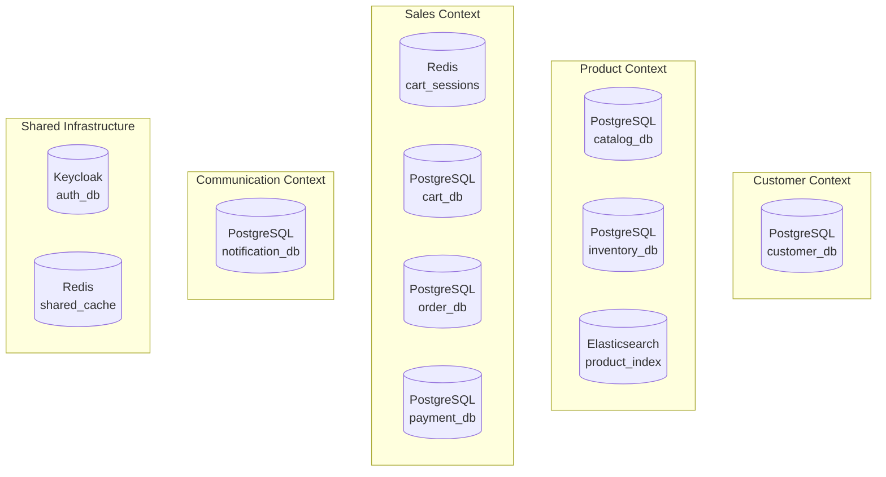

# E-commerce Platform - Database Design

## Database Architecture Overview

The e-commerce platform follows the **Database per Service** pattern, ensuring data autonomy and service independence. Each microservice owns its data and database schema, communicating through well-defined APIs and events.

## Database Distribution Strategy



## 1. Customer Service Database (PostgreSQL)

### Schema: `customer_db`

```sql
-- Customer aggregate
CREATE TABLE customers (
    id UUID PRIMARY KEY DEFAULT gen_random_uuid(),
    email VARCHAR(255) UNIQUE NOT NULL,
    first_name VARCHAR(100) NOT NULL,
    last_name VARCHAR(100) NOT NULL,
    phone VARCHAR(20),
    date_of_birth DATE,
    customer_status VARCHAR(20) DEFAULT 'active', -- active, inactive, suspended
    tier VARCHAR(20) DEFAULT 'regular', -- regular, premium, vip
    created_at TIMESTAMP DEFAULT CURRENT_TIMESTAMP,
    updated_at TIMESTAMP DEFAULT CURRENT_TIMESTAMP,
    version BIGINT DEFAULT 1
);

-- Customer addresses
CREATE TABLE customer_addresses (
    id UUID PRIMARY KEY DEFAULT gen_random_uuid(),
    customer_id UUID NOT NULL REFERENCES customers(id),
    address_type VARCHAR(20) NOT NULL, -- billing, shipping, both
    label VARCHAR(50), -- home, work, etc.
    street_line_1 VARCHAR(200) NOT NULL,
    street_line_2 VARCHAR(200),
    city VARCHAR(100) NOT NULL,
    state_province VARCHAR(100) NOT NULL,
    postal_code VARCHAR(20) NOT NULL,
    country_code VARCHAR(3) NOT NULL,
    is_default BOOLEAN DEFAULT false,
    created_at TIMESTAMP DEFAULT CURRENT_TIMESTAMP
);

-- Customer preferences
CREATE TABLE customer_preferences (
    id UUID PRIMARY KEY DEFAULT gen_random_uuid(),
    customer_id UUID UNIQUE NOT NULL REFERENCES customers(id),
    email_notifications BOOLEAN DEFAULT true,
    sms_notifications BOOLEAN DEFAULT false,
    push_notifications BOOLEAN DEFAULT true,
    marketing_emails BOOLEAN DEFAULT true,
    preferred_language VARCHAR(10) DEFAULT 'en-US',
    preferred_currency VARCHAR(3) DEFAULT 'USD',
    theme_preference VARCHAR(20) DEFAULT 'light',
    created_at TIMESTAMP DEFAULT CURRENT_TIMESTAMP,
    updated_at TIMESTAMP DEFAULT CURRENT_TIMESTAMP
);

-- Customer loyalty points
CREATE TABLE customer_loyalty (
    id UUID PRIMARY KEY DEFAULT gen_random_uuid(),
    customer_id UUID UNIQUE NOT NULL REFERENCES customers(id),
    points_balance INT DEFAULT 0,
    lifetime_points INT DEFAULT 0,
    tier_points INT DEFAULT 0,
    last_activity_at TIMESTAMP,
    created_at TIMESTAMP DEFAULT CURRENT_TIMESTAMP,
    updated_at TIMESTAMP DEFAULT CURRENT_TIMESTAMP
);

-- Indexes
CREATE INDEX idx_customers_email ON customers(email);
CREATE INDEX idx_customers_status ON customers(customer_status);
CREATE INDEX idx_customer_addresses_customer_id ON customer_addresses(customer_id);
CREATE INDEX idx_customer_addresses_type ON customer_addresses(address_type);
```

## 2. Catalog Service Database (PostgreSQL)

### Schema: `catalog_db`

```sql
-- Categories (hierarchical)
CREATE TABLE categories (
    id UUID PRIMARY KEY DEFAULT gen_random_uuid(),
    name VARCHAR(200) NOT NULL,
    slug VARCHAR(200) UNIQUE NOT NULL,
    description TEXT,
    parent_id UUID REFERENCES categories(id),
    display_order INT DEFAULT 0,
    meta_title VARCHAR(255),
    meta_description TEXT,
    meta_keywords TEXT,
    is_active BOOLEAN DEFAULT true,
    created_at TIMESTAMP DEFAULT CURRENT_TIMESTAMP,
    updated_at TIMESTAMP DEFAULT CURRENT_TIMESTAMP
);

-- Brands
CREATE TABLE brands (
    id UUID PRIMARY KEY DEFAULT gen_random_uuid(),
    name VARCHAR(200) UNIQUE NOT NULL,
    slug VARCHAR(200) UNIQUE NOT NULL,
    description TEXT,
    logo_url VARCHAR(500),
    website_url VARCHAR(500),
    is_active BOOLEAN DEFAULT true,
    created_at TIMESTAMP DEFAULT CURRENT_TIMESTAMP
);

-- Products (main aggregate)
CREATE TABLE products (
    id UUID PRIMARY KEY DEFAULT gen_random_uuid(),
    name VARCHAR(500) NOT NULL,
    slug VARCHAR(500) UNIQUE NOT NULL,
    description TEXT,
    short_description TEXT,
    sku VARCHAR(100) UNIQUE NOT NULL,
    category_id UUID NOT NULL REFERENCES categories(id),
    brand_id UUID REFERENCES brands(id),
    product_type VARCHAR(50) DEFAULT 'simple', -- simple, configurable, bundle
    weight DECIMAL(10,3),
    dimensions_length DECIMAL(10,2),
    dimensions_width DECIMAL(10,2), 
    dimensions_height DECIMAL(10,2),
    meta_title VARCHAR(255),
    meta_description TEXT,
    meta_keywords TEXT,
    status VARCHAR(20) DEFAULT 'draft', -- draft, active, inactive, archived
    created_at TIMESTAMP DEFAULT CURRENT_TIMESTAMP,
    updated_at TIMESTAMP DEFAULT CURRENT_TIMESTAMP,
    version BIGINT DEFAULT 1
);

-- Product variants
CREATE TABLE product_variants (
    id UUID PRIMARY KEY DEFAULT gen_random_uuid(),
    product_id UUID NOT NULL REFERENCES products(id) ON DELETE CASCADE,
    sku VARCHAR(100) UNIQUE NOT NULL,
    name VARCHAR(200),
    price DECIMAL(10,2) NOT NULL,
    compare_price DECIMAL(10,2),
    cost_price DECIMAL(10,2),
    weight DECIMAL(10,3),
    barcode VARCHAR(100),
    attributes JSONB, -- {"color": "red", "size": "M"}
    is_default BOOLEAN DEFAULT false,
    is_active BOOLEAN DEFAULT true,
    created_at TIMESTAMP DEFAULT CURRENT_TIMESTAMP,
    updated_at TIMESTAMP DEFAULT CURRENT_TIMESTAMP
);

-- Product images
CREATE TABLE product_images (
    id UUID PRIMARY KEY DEFAULT gen_random_uuid(),
    product_id UUID NOT NULL REFERENCES products(id) ON DELETE CASCADE,
    variant_id UUID REFERENCES product_variants(id),
    url VARCHAR(500) NOT NULL,
    alt_text VARCHAR(200),
    display_order INT DEFAULT 0,
    is_primary BOOLEAN DEFAULT false,
    created_at TIMESTAMP DEFAULT CURRENT_TIMESTAMP
);

-- Product attributes (for filters)
CREATE TABLE product_attributes (
    id UUID PRIMARY KEY DEFAULT gen_random_uuid(),
    name VARCHAR(100) UNIQUE NOT NULL,
    display_name VARCHAR(100) NOT NULL,
    attribute_type VARCHAR(20) NOT NULL, -- text, number, boolean, select
    is_filterable BOOLEAN DEFAULT false,
    is_searchable BOOLEAN DEFAULT false,
    display_order INT DEFAULT 0,
    created_at TIMESTAMP DEFAULT CURRENT_TIMESTAMP
);

-- Product attribute values
CREATE TABLE product_attribute_values (
    id UUID PRIMARY KEY DEFAULT gen_random_uuid(),
    attribute_id UUID NOT NULL REFERENCES product_attributes(id),
    value VARCHAR(200) NOT NULL,
    display_value VARCHAR(200) NOT NULL,
    display_order INT DEFAULT 0,
    UNIQUE(attribute_id, value)
);

-- Product reviews
CREATE TABLE product_reviews (
    id UUID PRIMARY KEY DEFAULT gen_random_uuid(),
    product_id UUID NOT NULL REFERENCES products(id),
    customer_id UUID NOT NULL, -- Reference to customer service
    rating INT CHECK (rating >= 1 AND rating <= 5),
    title VARCHAR(200),
    content TEXT,
    is_verified_purchase BOOLEAN DEFAULT false,
    is_approved BOOLEAN DEFAULT false,
    helpful_count INT DEFAULT 0,
    created_at TIMESTAMP DEFAULT CURRENT_TIMESTAMP,
    updated_at TIMESTAMP DEFAULT CURRENT_TIMESTAMP
);

-- Cross-sell and upsell relationships
CREATE TABLE product_relations (
    id UUID PRIMARY KEY DEFAULT gen_random_uuid(),
    product_id UUID NOT NULL REFERENCES products(id),
    related_product_id UUID NOT NULL REFERENCES products(id),
    relation_type VARCHAR(20) NOT NULL, -- cross_sell, up_sell, related
    display_order INT DEFAULT 0,
    UNIQUE(product_id, related_product_id, relation_type)
);

-- Indexes for performance
CREATE INDEX idx_products_category ON products(category_id);
CREATE INDEX idx_products_brand ON products(brand_id);
CREATE INDEX idx_products_status ON products(status);
CREATE INDEX idx_products_slug ON products(slug);
CREATE INDEX idx_variants_product ON product_variants(product_id);
CREATE INDEX idx_variants_sku ON product_variants(sku);
CREATE INDEX idx_variants_attributes ON product_variants USING gin(attributes);
CREATE INDEX idx_categories_parent ON categories(parent_id);
CREATE INDEX idx_reviews_product ON product_reviews(product_id);
CREATE INDEX idx_reviews_customer ON product_reviews(customer_id);
```

## 3. Inventory Service Database (PostgreSQL)

### Schema: `inventory_db`

```sql
-- Inventory items (one per product variant)
CREATE TABLE inventory_items (
    id UUID PRIMARY KEY DEFAULT gen_random_uuid(),
    product_variant_id UUID UNIQUE NOT NULL, -- Foreign key to catalog service
    sku VARCHAR(100) NOT NULL,
    quantity_available INT NOT NULL DEFAULT 0,
    quantity_reserved INT NOT NULL DEFAULT 0,
    quantity_committed INT NOT NULL DEFAULT 0, -- allocated for orders
    low_stock_threshold INT DEFAULT 10,
    reorder_point INT DEFAULT 20,
    reorder_quantity INT DEFAULT 100,
    last_restocked_at TIMESTAMP,
    created_at TIMESTAMP DEFAULT CURRENT_TIMESTAMP,
    updated_at TIMESTAMP DEFAULT CURRENT_TIMESTAMP,
    version BIGINT DEFAULT 1 -- for optimistic locking
);

-- Inventory transactions (event sourcing style)
CREATE TABLE inventory_transactions (
    id UUID PRIMARY KEY DEFAULT gen_random_uuid(),
    inventory_item_id UUID NOT NULL REFERENCES inventory_items(id),
    transaction_type VARCHAR(20) NOT NULL, -- restock, sale, adjustment, reservation, release
    quantity_change INT NOT NULL, -- positive or negative
    reference_id UUID, -- order_id, adjustment_id, etc.
    reference_type VARCHAR(20), -- order, adjustment, return
    reason VARCHAR(200),
    created_by UUID, -- user or system that created the transaction
    created_at TIMESTAMP DEFAULT CURRENT_TIMESTAMP
);

-- Stock adjustments
CREATE TABLE stock_adjustments (
    id UUID PRIMARY KEY DEFAULT gen_random_uuid(),
    adjustment_number VARCHAR(50) UNIQUE NOT NULL,
    reason VARCHAR(200) NOT NULL,
    notes TEXT,
    status VARCHAR(20) DEFAULT 'pending', -- pending, approved, rejected
    created_by UUID NOT NULL,
    approved_by UUID,
    created_at TIMESTAMP DEFAULT CURRENT_TIMESTAMP,
    approved_at TIMESTAMP
);

-- Stock adjustment items
CREATE TABLE stock_adjustment_items (
    id UUID PRIMARY KEY DEFAULT gen_random_uuid(),
    adjustment_id UUID NOT NULL REFERENCES stock_adjustments(id),
    inventory_item_id UUID NOT NULL REFERENCES inventory_items(id),
    current_quantity INT NOT NULL,
    adjusted_quantity INT NOT NULL,
    quantity_difference INT NOT NULL
);

-- Inventory reservations (for orders being processed)
CREATE TABLE inventory_reservations (
    id UUID PRIMARY KEY DEFAULT gen_random_uuid(),
    inventory_item_id UUID NOT NULL REFERENCES inventory_items(id),
    order_id UUID NOT NULL,
    quantity_reserved INT NOT NULL,
    expires_at TIMESTAMP NOT NULL,
    status VARCHAR(20) DEFAULT 'active', -- active, committed, released, expired
    created_at TIMESTAMP DEFAULT CURRENT_TIMESTAMP,
    updated_at TIMESTAMP DEFAULT CURRENT_TIMESTAMP
);

-- Low stock alerts
CREATE TABLE low_stock_alerts (
    id UUID PRIMARY KEY DEFAULT gen_random_uuid(),
    inventory_item_id UUID NOT NULL REFERENCES inventory_items(id),
    alert_type VARCHAR(20) NOT NULL, -- low_stock, out_of_stock
    current_quantity INT NOT NULL,
    threshold_quantity INT NOT NULL,
    is_acknowledged BOOLEAN DEFAULT false,
    acknowledged_by UUID,
    acknowledged_at TIMESTAMP,
    created_at TIMESTAMP DEFAULT CURRENT_TIMESTAMP
);

-- Indexes
CREATE INDEX idx_inventory_variant ON inventory_items(product_variant_id);
CREATE INDEX idx_inventory_sku ON inventory_items(sku);
CREATE INDEX idx_inventory_low_stock ON inventory_items(quantity_available) 
    WHERE quantity_available <= low_stock_threshold;
CREATE INDEX idx_transactions_item ON inventory_transactions(inventory_item_id);
CREATE INDEX idx_transactions_type ON inventory_transactions(transaction_type);
CREATE INDEX idx_reservations_order ON inventory_reservations(order_id);
CREATE INDEX idx_reservations_status ON inventory_reservations(status);
CREATE INDEX idx_reservations_expires ON inventory_reservations(expires_at);
```

## 4. Order Service Database (PostgreSQL)

### Schema: `order_db`

```sql
-- Orders (main aggregate)
CREATE TABLE orders (
    id UUID PRIMARY KEY DEFAULT gen_random_uuid(),
    order_number VARCHAR(50) UNIQUE NOT NULL,
    customer_id UUID NOT NULL, -- Reference to customer service
    email VARCHAR(255) NOT NULL, -- Store for guest orders
    status VARCHAR(20) NOT NULL DEFAULT 'pending', -- pending, confirmed, processing, shipped, delivered, cancelled, refunded
    subtotal DECIMAL(10,2) NOT NULL,
    tax_amount DECIMAL(10,2) NOT NULL DEFAULT 0,
    shipping_amount DECIMAL(10,2) NOT NULL DEFAULT 0,
    discount_amount DECIMAL(10,2) NOT NULL DEFAULT 0,
    total_amount DECIMAL(10,2) NOT NULL,
    currency VARCHAR(3) NOT NULL DEFAULT 'USD',
    
    -- Shipping information
    shipping_method VARCHAR(50),
    shipping_carrier VARCHAR(50),
    tracking_number VARCHAR(100),
    estimated_delivery_date DATE,
    actual_delivery_date DATE,
    
    -- Addresses (denormalized for order history)
    shipping_address JSONB NOT NULL,
    billing_address JSONB NOT NULL,
    
    -- Order metadata
    order_source VARCHAR(20) DEFAULT 'web', -- web, mobile, admin
    notes TEXT,
    internal_notes TEXT,
    
    created_at TIMESTAMP DEFAULT CURRENT_TIMESTAMP,
    updated_at TIMESTAMP DEFAULT CURRENT_TIMESTAMP,
    version BIGINT DEFAULT 1
);

-- Order items
CREATE TABLE order_items (
    id UUID PRIMARY KEY DEFAULT gen_random_uuid(),
    order_id UUID NOT NULL REFERENCES orders(id) ON DELETE CASCADE,
    product_variant_id UUID NOT NULL, -- Reference to catalog service
    sku VARCHAR(100) NOT NULL,
    product_name VARCHAR(500) NOT NULL,
    variant_name VARCHAR(200),
    quantity INT NOT NULL,
    unit_price DECIMAL(10,2) NOT NULL,
    total_price DECIMAL(10,2) NOT NULL,
    
    -- Snapshot of product data at time of order
    product_data JSONB, -- attributes, image_url, etc.
    
    created_at TIMESTAMP DEFAULT CURRENT_TIMESTAMP
);

-- Order status history
CREATE TABLE order_status_history (
    id UUID PRIMARY KEY DEFAULT gen_random_uuid(),
    order_id UUID NOT NULL REFERENCES orders(id),
    previous_status VARCHAR(20),
    new_status VARCHAR(20) NOT NULL,
    notes TEXT,
    changed_by UUID, -- admin user who changed status
    created_at TIMESTAMP DEFAULT CURRENT_TIMESTAMP
);

-- Order discounts/promotions
CREATE TABLE order_discounts (
    id UUID PRIMARY KEY DEFAULT gen_random_uuid(),
    order_id UUID NOT NULL REFERENCES orders(id),
    discount_type VARCHAR(20) NOT NULL, -- coupon, promotion, loyalty
    discount_code VARCHAR(50),
    discount_name VARCHAR(200) NOT NULL,
    discount_amount DECIMAL(10,2) NOT NULL,
    created_at TIMESTAMP DEFAULT CURRENT_TIMESTAMP
);

-- Indexes
CREATE INDEX idx_orders_customer ON orders(customer_id);
CREATE INDEX idx_orders_status ON orders(status);
CREATE INDEX idx_orders_number ON orders(order_number);
CREATE INDEX idx_orders_created ON orders(created_at);
CREATE INDEX idx_order_items_order ON order_items(order_id);
CREATE INDEX idx_order_items_variant ON order_items(product_variant_id);
CREATE INDEX idx_status_history_order ON order_status_history(order_id);
```

## 5. Cart Service Database

### Redis (Primary Storage)
```redis
# Cart session data (TTL: 7 days)
cart:session:{sessionId} -> {
    "customerId": "uuid",
    "items": [
        {
            "variantId": "uuid",
            "quantity": 2,
            "price": 29.99,
            "addedAt": "timestamp"
        }
    ],
    "totals": {
        "subtotal": 59.98,
        "itemCount": 2
    },
    "createdAt": "timestamp",
    "updatedAt": "timestamp"
}

# Customer cart mapping
cart:customer:{customerId} -> {sessionId}

# Guest cart conversion
cart:conversion:{customerId} -> {guestSessionId}
```

### PostgreSQL (Persistent Storage)
```sql
-- Schema: cart_db
-- Persistent cart for logged-in customers
CREATE TABLE shopping_carts (
    id UUID PRIMARY KEY DEFAULT gen_random_uuid(),
    customer_id UUID UNIQUE NOT NULL,
    session_id VARCHAR(100),
    created_at TIMESTAMP DEFAULT CURRENT_TIMESTAMP,
    updated_at TIMESTAMP DEFAULT CURRENT_TIMESTAMP
);

CREATE TABLE cart_items (
    id UUID PRIMARY KEY DEFAULT gen_random_uuid(),
    cart_id UUID NOT NULL REFERENCES shopping_carts(id) ON DELETE CASCADE,
    product_variant_id UUID NOT NULL,
    sku VARCHAR(100) NOT NULL,
    quantity INT NOT NULL,
    unit_price DECIMAL(10,2) NOT NULL,
    added_at TIMESTAMP DEFAULT CURRENT_TIMESTAMP,
    updated_at TIMESTAMP DEFAULT CURRENT_TIMESTAMP,
    UNIQUE(cart_id, product_variant_id)
);

-- Abandoned cart tracking
CREATE TABLE abandoned_carts (
    id UUID PRIMARY KEY DEFAULT gen_random_uuid(),
    customer_id UUID,
    email VARCHAR(255),
    cart_data JSONB NOT NULL,
    abandoned_at TIMESTAMP DEFAULT CURRENT_TIMESTAMP,
    recovery_email_sent BOOLEAN DEFAULT false,
    recovery_email_sent_at TIMESTAMP
);

-- Indexes
CREATE INDEX idx_carts_customer ON shopping_carts(customer_id);
CREATE INDEX idx_cart_items_cart ON cart_items(cart_id);
CREATE INDEX idx_cart_items_variant ON cart_items(product_variant_id);
CREATE INDEX idx_abandoned_carts_customer ON abandoned_carts(customer_id);
```

## 6. Payment Service Database (PostgreSQL)

### Schema: `payment_db`

```sql
-- Payment methods
CREATE TABLE payment_methods (
    id UUID PRIMARY KEY DEFAULT gen_random_uuid(),
    customer_id UUID NOT NULL,
    method_type VARCHAR(20) NOT NULL, -- card, paypal, bank_transfer
    provider VARCHAR(50) NOT NULL, -- stripe, paypal, etc.
    external_id VARCHAR(100), -- provider's payment method ID
    is_default BOOLEAN DEFAULT false,
    
    -- Masked payment details (for display)
    display_name VARCHAR(100), -- "**** **** **** 1234"
    card_brand VARCHAR(20), -- visa, mastercard
    card_last_four VARCHAR(4),
    card_expiry_month INT,
    card_expiry_year INT,
    
    is_active BOOLEAN DEFAULT true,
    created_at TIMESTAMP DEFAULT CURRENT_TIMESTAMP,
    updated_at TIMESTAMP DEFAULT CURRENT_TIMESTAMP
);

-- Payments (main aggregate)
CREATE TABLE payments (
    id UUID PRIMARY KEY DEFAULT gen_random_uuid(),
    order_id UUID NOT NULL,
    payment_method_id UUID REFERENCES payment_methods(id),
    amount DECIMAL(10,2) NOT NULL,
    currency VARCHAR(3) NOT NULL DEFAULT 'USD',
    status VARCHAR(20) NOT NULL DEFAULT 'pending', -- pending, authorized, captured, failed, refunded
    payment_type VARCHAR(20) NOT NULL, -- payment, refund
    
    -- Provider details
    provider VARCHAR(50) NOT NULL,
    external_transaction_id VARCHAR(100),
    provider_fee DECIMAL(10,2),
    
    -- Authorization details
    authorized_amount DECIMAL(10,2),
    authorized_at TIMESTAMP,
    authorization_expires_at TIMESTAMP,
    
    -- Capture details  
    captured_amount DECIMAL(10,2),
    captured_at TIMESTAMP,
    
    -- Failure details
    failure_reason TEXT,
    failure_code VARCHAR(50),
    
    created_at TIMESTAMP DEFAULT CURRENT_TIMESTAMP,
    updated_at TIMESTAMP DEFAULT CURRENT_TIMESTAMP,
    version BIGINT DEFAULT 1
);

-- Payment events (event sourcing)
CREATE TABLE payment_events (
    id UUID PRIMARY KEY DEFAULT gen_random_uuid(),
    payment_id UUID NOT NULL REFERENCES payments(id),
    event_type VARCHAR(30) NOT NULL, -- created, authorized, captured, failed, refunded
    event_data JSONB NOT NULL,
    created_at TIMESTAMP DEFAULT CURRENT_TIMESTAMP
);

-- Refunds
CREATE TABLE refunds (
    id UUID PRIMARY KEY DEFAULT gen_random_uuid(),
    payment_id UUID NOT NULL REFERENCES payments(id),
    refund_amount DECIMAL(10,2) NOT NULL,
    reason VARCHAR(200),
    status VARCHAR(20) DEFAULT 'pending', -- pending, completed, failed
    external_refund_id VARCHAR(100),
    processed_at TIMESTAMP,
    created_at TIMESTAMP DEFAULT CURRENT_TIMESTAMP
);

-- Payment webhooks (for provider callbacks)
CREATE TABLE payment_webhooks (
    id UUID PRIMARY KEY DEFAULT gen_random_uuid(),
    provider VARCHAR(50) NOT NULL,
    event_type VARCHAR(50) NOT NULL,
    external_id VARCHAR(100),
    payload JSONB NOT NULL,
    processed BOOLEAN DEFAULT false,
    processed_at TIMESTAMP,
    created_at TIMESTAMP DEFAULT CURRENT_TIMESTAMP
);

-- Indexes
CREATE INDEX idx_payments_order ON payments(order_id);
CREATE INDEX idx_payments_status ON payments(status);
CREATE INDEX idx_payments_external ON payments(external_transaction_id);
CREATE INDEX idx_payment_methods_customer ON payment_methods(customer_id);
CREATE INDEX idx_refunds_payment ON refunds(payment_id);
CREATE INDEX idx_webhooks_processed ON payment_webhooks(processed, created_at);
```

## 7. Notification Service Database (PostgreSQL)

### Schema: `notification_db`

```sql
-- Notification templates
CREATE TABLE notification_templates (
    id UUID PRIMARY KEY DEFAULT gen_random_uuid(),
    name VARCHAR(100) UNIQUE NOT NULL,
    description TEXT,
    template_type VARCHAR(20) NOT NULL, -- email, sms, push
    subject_template TEXT,
    body_template TEXT NOT NULL,
    variables JSONB, -- List of variables used in template
    is_active BOOLEAN DEFAULT true,
    created_at TIMESTAMP DEFAULT CURRENT_TIMESTAMP,
    updated_at TIMESTAMP DEFAULT CURRENT_TIMESTAMP
);

-- Notifications
CREATE TABLE notifications (
    id UUID PRIMARY KEY DEFAULT gen_random_uuid(),
    template_id UUID REFERENCES notification_templates(id),
    recipient_id UUID NOT NULL, -- customer_id or admin_id
    recipient_email VARCHAR(255),
    recipient_phone VARCHAR(20),
    notification_type VARCHAR(50) NOT NULL, -- order_confirmation, shipping_update, etc.
    channel VARCHAR(20) NOT NULL, -- email, sms, push
    subject VARCHAR(500),
    content TEXT NOT NULL,
    metadata JSONB, -- Additional context data
    status VARCHAR(20) DEFAULT 'pending', -- pending, sent, delivered, failed
    
    -- Delivery tracking
    sent_at TIMESTAMP,
    delivered_at TIMESTAMP,
    failure_reason TEXT,
    retry_count INT DEFAULT 0,
    max_retries INT DEFAULT 3,
    next_retry_at TIMESTAMP,
    
    created_at TIMESTAMP DEFAULT CURRENT_TIMESTAMP
);

-- Notification preferences (per customer)
CREATE TABLE notification_preferences (
    id UUID PRIMARY KEY DEFAULT gen_random_uuid(),
    customer_id UUID UNIQUE NOT NULL,
    email_enabled BOOLEAN DEFAULT true,
    sms_enabled BOOLEAN DEFAULT false,
    push_enabled BOOLEAN DEFAULT true,
    marketing_emails BOOLEAN DEFAULT true,
    order_updates BOOLEAN DEFAULT true,
    promotional_offers BOOLEAN DEFAULT true,
    security_alerts BOOLEAN DEFAULT true,
    created_at TIMESTAMP DEFAULT CURRENT_TIMESTAMP,
    updated_at TIMESTAMP DEFAULT CURRENT_TIMESTAMP
);

-- Email delivery tracking
CREATE TABLE email_events (
    id UUID PRIMARY KEY DEFAULT gen_random_uuid(),
    notification_id UUID NOT NULL REFERENCES notifications(id),
    event_type VARCHAR(20) NOT NULL, -- sent, delivered, opened, clicked, bounced, spam
    provider VARCHAR(50) NOT NULL, -- sendgrid, ses, mailgun
    external_message_id VARCHAR(100),
    user_agent TEXT,
    ip_address INET,
    created_at TIMESTAMP DEFAULT CURRENT_TIMESTAMP
);

-- Indexes
CREATE INDEX idx_notifications_recipient ON notifications(recipient_id);
CREATE INDEX idx_notifications_status ON notifications(status);
CREATE INDEX idx_notifications_type ON notifications(notification_type);
CREATE INDEX idx_notifications_channel ON notifications(channel);
CREATE INDEX idx_notifications_retry ON notifications(next_retry_at) 
    WHERE status = 'pending' AND retry_count < max_retries;
CREATE INDEX idx_email_events_notification ON email_events(notification_id);
```

## 8. Search Service (Elasticsearch)

### Product Index Schema
```json
{
  "mappings": {
    "properties": {
      "id": { "type": "keyword" },
      "name": { 
        "type": "text",
        "analyzer": "standard",
        "fields": {
          "keyword": { "type": "keyword" },
          "suggest": { "type": "completion" }
        }
      },
      "description": { "type": "text", "analyzer": "standard" },
      "category": {
        "properties": {
          "id": { "type": "keyword" },
          "name": { "type": "keyword" },
          "path": { "type": "keyword" }
        }
      },
      "brand": {
        "properties": {
          "id": { "type": "keyword" },
          "name": { "type": "keyword" }
        }
      },
      "price": { "type": "double" },
      "compare_price": { "type": "double" },
      "rating": { "type": "double" },
      "review_count": { "type": "integer" },
      "availability": { "type": "boolean" },
      "tags": { "type": "keyword" },
      "attributes": {
        "type": "nested",
        "properties": {
          "name": { "type": "keyword" },
          "value": { "type": "keyword" }
        }
      },
      "created_at": { "type": "date" },
      "updated_at": { "type": "date" }
    }
  }
}
```

## Data Migration Strategy

### 1. Existing Base Service Enhancement
```sql
-- Migration script for Base Service → Catalog Service
-- Add new columns to existing products table
ALTER TABLE products ADD COLUMN IF NOT EXISTS category_id UUID;
ALTER TABLE products ADD COLUMN IF NOT EXISTS brand_id UUID;
ALTER TABLE products ADD COLUMN IF NOT EXISTS compare_price DECIMAL(10,2);
ALTER TABLE products ADD COLUMN IF NOT EXISTS status VARCHAR(20) DEFAULT 'active';

-- Create new tables
-- (Execute category, brand, variant table creation scripts)

-- Migrate existing data
UPDATE products SET status = 'active' WHERE status IS NULL;
```

### 2. Data Consistency Patterns

#### Saga Pattern for Distributed Transactions
```sql
-- Saga state table (in Order Service)
CREATE TABLE order_processing_sagas (
    id UUID PRIMARY KEY,
    order_id UUID NOT NULL,
    current_step VARCHAR(50) NOT NULL,
    saga_data JSONB NOT NULL,
    status VARCHAR(20) DEFAULT 'started', -- started, completed, failed
    created_at TIMESTAMP DEFAULT CURRENT_TIMESTAMP,
    updated_at TIMESTAMP DEFAULT CURRENT_TIMESTAMP
);
```

#### Event Store for Audit Trail
```sql
-- Shared event store (can be in each service or centralized)
CREATE TABLE domain_events (
    id UUID PRIMARY KEY DEFAULT gen_random_uuid(),
    aggregate_id UUID NOT NULL,
    aggregate_type VARCHAR(50) NOT NULL,
    event_type VARCHAR(100) NOT NULL,
    event_data JSONB NOT NULL,
    version BIGINT NOT NULL,
    occurred_at TIMESTAMP DEFAULT CURRENT_TIMESTAMP,
    processed BOOLEAN DEFAULT false
);
```

## Performance Optimization

### 1. Database Indexing Strategy
- **Primary Keys**: UUID with appropriate clustering
- **Foreign Keys**: Indexed for join performance
- **Query Patterns**: Indexes based on common query patterns
- **Composite Indexes**: For multi-column queries
- **Partial Indexes**: For filtered queries

### 2. Connection Pooling
```csharp
// Connection pool configuration
"ConnectionStrings": {
  "CatalogDB": "Host=localhost;Database=catalog_db;Username=catalog_user;Password=***;Pooling=true;Minimum Pool Size=5;Maximum Pool Size=50;Connection Idle Lifetime=30"
}
```

### 3. Read Replicas
- **Master-Slave Replication**: For read-heavy workloads
- **Load Balancing**: Route reads to replicas
- **Eventual Consistency**: Acceptable for product catalog reads

This database design provides a solid foundation for the e-commerce platform while maintaining service autonomy and data consistency across the microservices architecture.